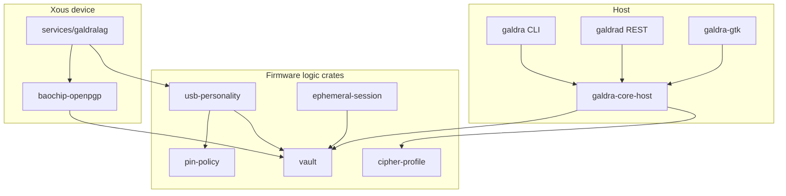

# Code map (function and module index)

This document lists **where** Rust modules, types, and functions live in the Galdralag / Galdr workspace. Use it to navigate the tree before opening files. For protocol behaviour and cross-crate flows, see also:

- [ARCHITECTURE.md](ARCHITECTURE.md) — Xous servers, RRAM layout, threat model
- [API_REFERENCE.md](API_REFERENCE.md) — Shamir, ephemeral session, and major public APIs in prose
- `cargo doc -p <crate> --open` — full signatures and trait bounds

**Scope:** workspace members under `crates/`, host apps (`galdra`, `galdrad`, `galdra-gtk`, `galdra-core-host`), `xtask`, and the Xous service `services/galdralag`. Excludes `fuzz/` targets (listed in [Fuzz targets](#fuzz-targets)), test-only modules, and the separately built `baochip-openpgp` workspace member (still indexed here).

**Line links** point at the definition line in each file (GitHub-style `#Lnn` anchors).

---

## Workspace at a glance

| Path | Crate / binary | Role |
|------|----------------|------|
| `crates/vault` | `galdr-vault` | RRAM vault, ciphers, Brainpool/RSA, Shamir, sealed keys |
| `crates/pin-policy` | `pin-policy` | PIN FSM, constant-time compare |
| `crates/cipher-profile` | `cipher-profile` | Named cipher stacks and registry |
| `crates/usb-personality` | `usb-personality` | CCID + OpenPGP card dispatch |
| `crates/ephemeral-session` | `ephemeral-session` | Authenticated ephemeral ECDH sessions |
| `crates/galdr-core` | `galdr-core` | HAL traits, shared errors |
| `crates/cess` | `cess` | CESS cascade encryption |
| `crates/biometric-*` | biometric crates | Device API and backends |
| `crates/baochip-openpgp` | (separate manifest) | Xous vault backend for OpenPGP |
| `services/galdralag` | `galdralag-service` | Xous CCID main loop |
| `galdra-core-host` | `galdra-core-host` | Host library (DB, device, crypto) |
| `galdra` | `galdra` | CLI |
| `galdrad` | `galdrad` | REST daemon |
| `galdra-gtk` | `galdra-gtk` | GTK UI |
| `xtask` | `xtask` | `test-all`, fuzz, embedded build helpers |

---

## Entry points

| Binary / service | File | Main symbols |
|------------------|------|--------------|
| Xous firmware service | `services/galdralag/src/main.rs` | `main`, `galdralag_ccid_main`, `ccid_serve_loop` |
| Galdra CLI | `galdra/src/main.rs` | `Cli`, `Commands`, `main` (subcommands in `*_cmds.rs`, `commands/`) |
| Galdra REST | `galdrad/src/main.rs` | `main`, `run`; HTTP routes in [`router`](galdrad/src/api.rs#L788) |
| Galdra GTK | `galdra-gtk/src/main.rs` | `main` |
| xtask | `xtask/src/main.rs` | `main`; `test_all::run`, `timing_test::run` |
| host-tools | `crates/host-tools/src/main.rs`, `provision.rs` | provisioning utilities |
| dudect harness | `crates/security-tests/src/bin/dudect_galdr.rs` | `main` |

OpenPGP APDU dispatch hub: [`handle_apdu`](crates/usb-personality/src/openpgp/dispatch.rs#L135) in `usb-personality`, wired from `galdralag` via [`OpenPgpCcidDispatcher`](crates/usb-personality/src/openpgp/dispatch.rs#L135).

---

## Find by topic

| Topic | Start here |
|-------|------------|
| Shamir split/recover | `crates/vault/src/shamir.rs`, `galdra-core-host/src/shamir_ops.rs`, `galdra/src/shamir_cmds.rs` |
| PIN policy | `crates/pin-policy/src/machine.rs`, `crates/vault/src/vault_pin_policy.rs` |
| HKDF labels | `crates/vault/src/kdf_policy.rs`, `crates/ephemeral-session/src/hkdf_labels.rs` |
| Ephemeral ECDH session | `crates/ephemeral-session/src/handshake.rs`, `protocol.rs`, `keys.rs` |
| OpenPGP commands | `crates/usb-personality/src/openpgp/commands/` (`sign`, `decipher`, `get_data`, …) |
| Cipher profiles | `crates/cipher-profile/src/profile.rs`, `registry.rs` |
| Host contacts / groups | `galdra-core-host/src/contacts.rs`, `groups.rs`, `db.rs` |
| Constant-time tests | `crates/security-tests/src/dudect_harnesses.rs` |

---

## Per-crate index

## `baochip-openpgp`
Xous OpenPGP vault backend bridge (separate manifest).

**Files:** 1 | **Public functions:** 15 | **Private functions:** 22

### `crates/baochip-openpgp/src/xous_impl.rs`
- **Public types:** `const OPENPGP_MASTER_RECORD_BYTES`, `const CCID_PIN_PROVISION_PAYLOAD_MAX_BYTES`, `const CCID_PIN_PROVISION_SLOT_BYTES`, `struct RramVaultStorage`, `struct RramMonotonicCounter`, `struct BaochipVaultZeroise`, `struct BaochipPinZeroise`, `type BaochipVaultBackend`
- **Public functions:** [`init_pin_zeroise_singleton`](crates/baochip-openpgp/src/xous_impl.rs#L30), [`vault_phys_base`](crates/baochip-openpgp/src/xous_impl.rs#L36), [`openpgp_vault_logical_span_end`](crates/baochip-openpgp/src/xous_impl.rs#L104), [`map_openpgp_rram_windows`](crates/baochip-openpgp/src/xous_impl.rs#L109), [`new`](crates/baochip-openpgp/src/xous_impl.rs#L215), [`load_or_derive_ccid_master_key`](crates/baochip-openpgp/src/xous_impl.rs#L256), [`master_key_dev_from_env`](crates/baochip-openpgp/src/xous_impl.rs#L287), [`master_key_from_hex64`](crates/baochip-openpgp/src/xous_impl.rs#L293), [`provision_slots_have_valid_pins`](crates/baochip-openpgp/src/xous_impl.rs#L340), [`write_provisioning_pins`](crates/baochip-openpgp/src/xous_impl.rs#L346), [`ccid_pin_hashes_unprovisioned`](crates/baochip-openpgp/src/xous_impl.rs#L417), [`load_or_provision_ccid_user_pin_bytes`](crates/baochip-openpgp/src/xous_impl.rs#L427), [`load_or_provision_ccid_admin_pin_bytes`](crates/baochip-openpgp/src/xous_impl.rs#L436), [`ccid_pins_dev_from_env`](crates/baochip-openpgp/src/xous_impl.rs#L454), [`open_or_provision_backend`](crates/baochip-openpgp/src/xous_impl.rs#L470)
- **Private functions:** 22 (open file for full list)

## `biometric-api`
Biometric challenge/verify API surface.

**Files:** 1 | **Public functions:** 7 | **Private functions:** 7

### `crates/biometric-api/src/lib.rs`
- **Public types:** `const MATCH_PAYLOAD_VERSION`, `enum BiometricBackend`, `enum Modality`, `struct MatchPayload`, `struct SignedMatchResult`, `struct BiometricSessionToken`, `enum BiometricError`, `trait BiometricBackendDriver`
- **Public functions:** [`match_payload_cbor_bytes`](crates/biometric-api/src/lib.rs#L107), [`verify_match_payload_signature`](crates/biometric-api/src/lib.rs#L112), [`sign_match_result`](crates/biometric-api/src/lib.rs#L125), [`signed_match_to_cbor`](crates/biometric-api/src/lib.rs#L137), [`signed_match_from_bytes`](crates/biometric-api/src/lib.rs#L146), [`galdrad_validate_match_result`](crates/biometric-api/src/lib.rs#L160), [`fuzz_try_verify_signed_match`](crates/biometric-api/src/lib.rs#L190)
- **Private functions:** `fmt` (L84), `from` (L101), `backend` (L208), `authenticate` (L211), `enroll` (L218), `device_pubkey` (L220), `probe` (L222)

## `biometric-fingervein`
Finger-vein device backend.

**Files:** 1 | **Public functions:** 4 | **Private functions:** 11

### `crates/biometric-fingervein/src/lib.rs`
- **Public types:** `struct FingerVeinDevice`, `struct MockFingerVeinDevice`
- **Public functions:** [`new`](crates/biometric-fingervein/src/lib.rs#L24), [`connect`](crates/biometric-fingervein/src/lib.rs#L33), [`disconnect`](crates/biometric-fingervein/src/lib.rs#L42), [`new`](crates/biometric-fingervein/src/lib.rs#L106)
- **Private functions:** `connected` (L48), `backend` (L57), `authenticate` (L61), `enroll` (L73), `device_pubkey` (L81), `probe` (L85), `backend` (L122), `authenticate` (L126), `enroll` (L148), `device_pubkey` (L157), `probe` (L161)

## `biometric-sweet`
SWEET platform biometric backend.

**Files:** 1 | **Public functions:** 3 | **Private functions:** 11

### `crates/biometric-sweet/src/lib.rs`
- **Public types:** `struct SweetPlatform`, `struct MockSweetPlatform`
- **Public functions:** [`new`](crates/biometric-sweet/src/lib.rs#L23), [`connect`](crates/biometric-sweet/src/lib.rs#L32), [`new`](crates/biometric-sweet/src/lib.rs#L100)
- **Private functions:** `connected` (L41), `backend` (L50), `authenticate` (L54), `enroll` (L66), `device_pubkey` (L74), `probe` (L78), `backend` (L121), `authenticate` (L125), `enroll` (L147), `device_pubkey` (L156), `probe` (L160)

## `biometric-vault`
Vault integration for biometric templates.

**Files:** 1 | **Public functions:** 4 | **Private functions:** 3

### `crates/biometric-vault/src/lib.rs`
- **Public types:** `const RRAM_TOTAL_BYTES`, `const BIOMETRIC_REGION_OFFSET`, `const BIOMETRIC_REGION_SIZE`, `const MAX_TEMPLATE_SIZE_BYTES`, `const MAX_ENROLLED_PERSONS`, `const SAMPLES_PER_ENROLLMENT`, `enum VaultError`, `type ZeroizingVec`
- **Public functions:** [`encrypt_template`](crates/biometric-vault/src/lib.rs#L77), [`decrypt_template`](crates/biometric-vault/src/lib.rs#L109), [`generate_session_token`](crates/biometric-vault/src/lib.rs#L133), [`verify_session_token`](crates/biometric-vault/src/lib.rs#L151)
- **Private functions:** `derive_slot_key` (L42), `nonce_for_plaintext` (L58), `encrypt_decrypt_roundtrip_smoke` (L176)

## `cess`
CESS cascade encryption registry and wire format.

**Files:** 7 | **Public functions:** 16 | **Private functions:** 45

### `crates/cess/src/hkdf_blake3.rs`
- **Public functions:** [`hmac_blake3`](crates/cess/src/hkdf_blake3.rs#L19), [`hkdf_blake3`](crates/cess/src/hkdf_blake3.rs#L38), [`derive_k_outer`](crates/cess/src/hkdf_blake3.rs#L63)
- **Private functions:** `normalize_hmac_key` (L7), `cess_vector_classical_only_32` (L80), `cess_vector_explicit_salt_32_zero` (L91), `cess_vector_pin_wrap` (L103), `cess_vector_64_byte_expand` (L114)

### `crates/cess/src/inner_info.rs`
- **Public types:** `enum CessInnerEtM64Cipher`
- **Public functions:** [`cess_inner_cascade_layer_key_info`](crates/cess/src/inner_info.rs#L32), [`cess_inner_cascade_layer_nonce_info`](crates/cess/src/inner_info.rs#L42), [`cess_inner_cascade_etm64_info`](crates/cess/src/inner_info.rs#L52), [`cess_blake3_integrity_info`](crates/cess/src/inner_info.rs#L78), [`cess_blake3_integrity_gap_info`](crates/cess/src/inner_info.rs#L88)
- **Private functions:** `push_hex_u16_be` (L10), `push_layer_index` (L17), `cess_inner_key_info_matches_section_8_3_shape` (L102), `cess_blake3_integrity_example_0x0004` (L110), `cess_blake3_integrity_gap_info_shape` (L118)

### `crates/cess/src/lib.rs`
- **Modules:** `registry`
- **Public types:** `const CESS_OUTER_ENVELOPE_INFO_UTF8`, `const SUITE_ID_RESERVED`, `const WIRE_CURVE_BRAINPOOL_P384`, `const CESS_CORE_DEFAULT_CHACHA`, `const CASCADE_CHACHA_INNER_SERPENT_OUTER_P384`, `const CASCADE_CHACHA_INNER_SERPENT_OUTER_P512`
- **Public functions:** [`suite_id_for_profile_name`](crates/cess/src/lib.rs#L69)
- **Private functions:** `roundtrip_outer_plaintext` (L85), `reserved_suite_rejected` (L94), `builtin_profile_maps_to_registry_table` (L99), `registry_constants_match_listed_table` (L131), `gaps_in_table_are_unlisted` (L142)

### `crates/cess/src/mode_a.rs`
- **Public types:** `enum CessCryptoError`
- **Public functions:** [`seal_mode_a_outer`](crates/cess/src/mode_a.rs#L30), [`open_mode_a_outer`](crates/cess/src/mode_a.rs#L47)
- **Private functions:** `fmt` (L17), `chacha_roundtrip` (L65)

### `crates/cess/src/registry_ids.rs`
- **Public types:** `const LISTED_SUITE_ID_RANGES`
- **Public functions:** [`is_listed_suite_id`](crates/cess/src/registry_ids.rs#L28)
- **Private functions:** `range_endpoints_are_listed` (L42), `documented_gaps_are_unlisted` (L50), `newly_allocated_classical_rows_are_listed` (L61)

### `crates/cess/src/spec_tests.rs`
- **Private functions:** 21 (open file for full list)

### `crates/cess/src/wire.rs`
- **Public types:** `struct SuiteId`, `enum CessWireError`
- **Public functions:** [`new`](crates/cess/src/wire.rs#L12), [`raw`](crates/cess/src/wire.rs#L19), [`assemble_mode_a_outer_plaintext`](crates/cess/src/wire.rs#L49), [`parse_mode_a_outer_plaintext`](crates/cess/src/wire.rs#L65)
- **Private functions:** `fmt` (L36), `unlisted_suite_id_rejected_assemble` (L82), `unlisted_suite_id_rejected_parse` (L94), `listed_ids_roundtrip` (L103)

## `cipher-profile`
Named cipher stacks, curves, Shamir metadata, registry.

**Files:** 9 | **Public functions:** 36 | **Private functions:** 71

### `crates/cipher-profile/src/audit.rs`
- **Public types:** `struct ProfileAuditRecord`
- **Public functions:** [`curve_audit_str`](crates/cipher-profile/src/audit.rs#L25), [`layer_audit_name`](crates/cipher-profile/src/audit.rs#L34), [`to_audit_string`](crates/cipher-profile/src/audit.rs#L46)
- **Private functions:** `u8_decimal` (L70)

### `crates/cipher-profile/src/bin/cascade_kat_gen.rs`
- **Private functions:** `main` (L20)

### `crates/cipher-profile/src/cascade.rs`
- **Public types:** `struct CascadeCiphertext`, `struct CascadePlaintext`
- **Public functions:** [`as_bytes`](crates/cipher-profile/src/cascade.rs#L79), [`cascade_blob_before_outermost_encrypt`](crates/cipher-profile/src/cascade.rs#L99), [`cascade_encrypt`](crates/cipher-profile/src/cascade.rs#L172), [`cascade_decrypt`](crates/cipher-profile/src/cascade.rs#L191)
- **Private functions:** 29 (open file for full list)

### `crates/cipher-profile/src/domain.rs`
- **Public types:** `const MAX_CASCADE_PLAINTEXT`
- **Public functions:** [`layer_key_info`](crates/cipher-profile/src/domain.rs#L11), [`layer_nonce_info`](crates/cipher-profile/src/domain.rs#L20)
- **Private functions:** `build_layer_info` (L28), `push_bytes` (L60), `tr` (L73), `domain_labels_differ_by_layer_index` (L81), `domain_labels_differ_by_cipher` (L88), `domain_labels_differ_by_profile` (L95), `domain_key_and_nonce_differ` (L102)

### `crates/cipher-profile/src/error.rs`
- **Public types:** `enum CipherProfileError`

### `crates/cipher-profile/src/layer.rs`
- **Public types:** `enum CipherLayer`
- **Public functions:** [`domain_fragment`](crates/cipher-profile/src/layer.rs#L25), [`wire_id`](crates/cipher-profile/src/layer.rs#L36), [`from_wire`](crates/cipher-profile/src/layer.rs#L47)

### `crates/cipher-profile/src/profile.rs`
- **Public types:** `struct CipherProfile`, `struct CipherProfileBuilder`
- **Public functions:** [`name`](crates/cipher-profile/src/profile.rs#L29), [`description`](crates/cipher-profile/src/profile.rs#L34), [`curve`](crates/cipher-profile/src/profile.rs#L39), [`layers`](crates/cipher-profile/src/profile.rs#L44), [`shamir`](crates/cipher-profile/src/profile.rs#L49), [`ephemeral_ecdh`](crates/cipher-profile/src/profile.rs#L55), [`to_bytes`](crates/cipher-profile/src/profile.rs#L64), [`from_bytes`](crates/cipher-profile/src/profile.rs#L88), [`audit_record`](crates/cipher-profile/src/profile.rs#L168), [`new`](crates/cipher-profile/src/profile.rs#L200), [`description`](crates/cipher-profile/src/profile.rs#L216), [`curve`](crates/cipher-profile/src/profile.rs#L225), [`layer`](crates/cipher-profile/src/profile.rs#L231), [`shamir`](crates/cipher-profile/src/profile.rs#L247), [`ephemeral_ecdh`](crates/cipher-profile/src/profile.rs#L253), [`build`](crates/cipher-profile/src/profile.rs#L259)
- **Private functions:** 14 (open file for full list)

### `crates/cipher-profile/src/registry.rs`
- **Public types:** `struct ProfileRegistry`
- **Public functions:** [`with_builtins`](crates/cipher-profile/src/registry.rs#L24), [`register`](crates/cipher-profile/src/registry.rs#L45), [`get`](crates/cipher-profile/src/registry.rs#L59), [`list`](crates/cipher-profile/src/registry.rs#L64), [`remove`](crates/cipher-profile/src/registry.rs#L73)
- **Private functions:** 14 (open file for full list)

### `crates/cipher-profile/src/shamir_cfg.rs`
- **Public types:** `struct ShamirConfig`
- **Public functions:** [`new`](crates/cipher-profile/src/shamir_cfg.rs#L16), [`none`](crates/cipher-profile/src/shamir_cfg.rs#L30), [`is_active`](crates/cipher-profile/src/shamir_cfg.rs#L38)
- **Private functions:** `shamir_valid` (L48), `shamir_k_zero` (L59), `shamir_k_gt_n` (L67), `shamir_n_zero` (L75), `shamir_none` (L83)

## `ephemeral-session`
Forward-secret ECDH handshake and session keys.

**Files:** 7 | **Public functions:** 28 | **Private functions:** 44

### `crates/ephemeral-session/src/curve_select.rs`
- **Public types:** `enum SessionCurve`
- **Public functions:** [`wire_id`](crates/ephemeral-session/src/curve_select.rs#L17), [`from_wire`](crates/ephemeral-session/src/curve_select.rs#L26), [`public_key_len`](crates/ephemeral-session/src/curve_select.rs#L36)
- **Private functions:** `wire_id_roundtrip` (L50), `unknown_wire_id` (L61)

### `crates/ephemeral-session/src/error.rs`
- **Public types:** `enum EphemeralSessionError`
- **Private functions:** `from` (L50), `from` (L56), `from` (L64)

### `crates/ephemeral-session/src/handshake.rs`
- **Public types:** `const INIT_PROTOCOL_VERSION`, `const RESP_PROTOCOL_VERSION`, `const MAX_SIG_BYTES`, `const MAX_HANDSHAKE_BYTES`, `struct InitMessage`, `struct ResponseMessage`
- **Public functions:** [`serialise`](crates/ephemeral-session/src/handshake.rs#L71), [`parse`](crates/ephemeral-session/src/handshake.rs#L109), [`encode_fingerprint_hex`](crates/ephemeral-session/src/handshake.rs#L161), [`decode_fingerprint_hex`](crates/ephemeral-session/src/handshake.rs#L166), [`serialise`](crates/ephemeral-session/src/handshake.rs#L173), [`parse`](crates/ephemeral-session/src/handshake.rs#L220)
- **Private functions:** `hex_encode_32` (L38), `hex_decode_64` (L48), `val` (L52), `sample_init` (L291), `sample_resp` (L307), `init_message_serialise_parse_roundtrip` (L329), `response_message_serialise_parse_roundtrip` (L341), `parse_truncated_init_message` (L357), `parse_unknown_curve` (L363), `parse_version_mismatch` (L371)

### `crates/ephemeral-session/src/hkdf_labels.rs`
- **Modules:** `domain`
- **Public types:** `const PAYLOAD_KEY_I2R`, `const PAYLOAD_KEY_R2I`, `const GDSS_MASK_KEY`, `const GDSS_SYNC_KEY`, `const GDSS_TIMING_KEY`, `const MAC_KEY`
- **Private functions:** `domain_labels_all_distinct` (L34), `domain_labels_non_empty` (L51)

### `crates/ephemeral-session/src/keys.rs`
- **Public types:** `struct EphemeralKeyPair`, `struct EphemeralSharedSecret`, `struct SessionKeys`
- **Public functions:** [`generate`](crates/ephemeral-session/src/keys.rs#L36), [`public_key_bytes`](crates/ephemeral-session/src/keys.rs#L107), [`ecdh`](crates/ephemeral-session/src/keys.rs#L114), [`private_key_bytes_for_test`](crates/ephemeral-session/src/keys.rs#L162), [`cess_k_outer_mode_a`](crates/ephemeral-session/src/keys.rs#L197), [`derive_session_keys`](crates/ephemeral-session/src/keys.rs#L205), [`as_bytes_for_test`](crates/ephemeral-session/src/keys.rs#L252), [`cess_inner_cascade_ikm`](crates/ephemeral-session/src/keys.rs#L321), [`profile_prk`](crates/ephemeral-session/src/keys.rs#L328), [`as_gdss_keys`](crates/ephemeral-session/src/keys.rs#L338)
- **Private functions:** `pack_shared` (L167), `hkdf_extract_sha256` (L259), `ordered_epk_salt` (L272), `ephemeral_keypair_generate_lengths` (L355), `ecdh_commutativity` (L368), `ecdh_zeroises_private_key` (L384), `shared_secret_zeroised_after_derive` (L397), `session_keys_all_distinct` (L412), `cess_k_outer_mode_a_deterministic_before_derive` (L440), `cess_inner_cascade_ikm_retains_raw_ecdh` (L458), `session_keys_deterministic` (L475), `session_keys_salt_order_independent` (L501)

### `crates/ephemeral-session/src/protocol.rs`
- **Public types:** `enum SessionRole`, `struct InitiatorSession`, `struct ResponderSession`
- **Public functions:** [`new`](crates/ephemeral-session/src/protocol.rs#L52), [`init`](crates/ephemeral-session/src/protocol.rs#L59), [`complete`](crates/ephemeral-session/src/protocol.rs#L114), [`respond`](crates/ephemeral-session/src/protocol.rs#L242)
- **Private functions:** `complete_inner` (L140), `default` (L232), `init_sign_preimage` (L317), `response_sign_preimage` (L325), `sign_with_long_term` (L339), `verifying_sec1` (L375), `verify_with_cert` (L406)

### `crates/ephemeral-session/src/trust.rs`
- **Public types:** `const MAX_SEC1`, `struct LongTermCert`, `trait TrustStore`, `struct InMemoryTrustStore`
- **Public functions:** [`fingerprint_of`](crates/ephemeral-session/src/trust.rs#L25), [`fingerprint_ct_eq`](crates/ephemeral-session/src/trust.rs#L35), [`new`](crates/ephemeral-session/src/trust.rs#L59), [`add`](crates/ephemeral-session/src/trust.rs#L66), [`remove`](crates/ephemeral-session/src/trust.rs#L73)
- **Private functions:** `lookup` (L48), `default` (L90), `lookup` (L96), `sample_cert` (L121), `test_lookup_found` (L137), `test_lookup_not_found` (L147), `test_store_full` (L153), `test_remove` (L171)

## `galdr-core`
HAL traits (TRNG, zeroise), shared errors.

**Files:** 8 | **Public functions:** 9 | **Private functions:** 38

### `crates/galdr-core/src/crypto_rfc.rs`
- **Private functions:** `hkdf_sha256_rfc5869_appendix_a` (L8), `hkdf_sha512_expand_smoke` (L28), `chacha20poly1305_rfc8439_aead` (L38), `x25519_rfc7748` (L65), `ed25519_rfc8032_sign_verify_smoke` (L81), `hmac_sha256_rfc4231_case_1` (L95), `pbkdf2_hmac_sha1_rfc6070_count_1` (L110), `aes256_gcm_nist_one_block` (L121), `sha3_256_empty` (L143), `blake2b512_known_vector` (L152), `blake3_deterministic` (L164)

### `crates/galdr-core/src/error.rs`
- **Public types:** `enum GaldrError`, `enum HalError`

### `crates/galdr-core/src/fake_hal.rs`
- **Public types:** `struct FakeMonotonicCounter`, `struct FakeTrng`, `struct FakeZeroiseController`, `struct FakeRebootController`, `struct FakeVaultStorage`
- **Public functions:** [`new`](crates/galdr-core/src/fake_hal.rs#L18), [`set_fail_next`](crates/galdr-core/src/fake_hal.rs#L25), [`from_seed`](crates/galdr-core/src/fake_hal.rs#L57), [`new`](crates/galdr-core/src/fake_hal.rs#L97), [`new`](crates/galdr-core/src/fake_hal.rs#L127), [`new`](crates/galdr-core/src/fake_hal.rs#L152), [`set_fail_next_write`](crates/galdr-core/src/fake_hal.rs#L160), [`as_slice`](crates/galdr-core/src/fake_hal.rs#L165), [`zero_all`](crates/galdr-core/src/fake_hal.rs#L170)
- **Private functions:** 13 (open file for full list)

### `crates/galdr-core/src/hal.rs`
- **Public types:** `trait MonotonicCounter`, `trait HardwareTrng`, `trait ZeroiseController`, `trait VaultStorage`, `trait RebootController`
- **Private functions:** `read` (L14), `increment` (L18), `refund_on_success` (L23), `zeroise_region` (L42), `read` (L50), `write` (L51), `enter_update_mode` (L81)

### `crates/galdr-core/src/hal_tests.rs`
- **Private functions:** `read` (L9), `increment` (L13), `monotonic_counter_increments` (L20)

### `crates/galdr-core/src/lib.rs`
- **Modules:** `error`, `hal`, `fake_hal`

### `crates/galdr-core/src/property_tests.rs`
- **Private functions:** `read` (L10), `increment` (L14), `counter_never_decrements` (L22)

### `crates/galdr-core/src/scaffold_todos.rs`
- **Private functions:** `document_stub_panic_contract` (L9)

## `galdra`
CLI (profiles, Shamir, EPK, identity, keyserver).

**Files:** 13 | **Public functions:** 32 | **Private functions:** 48

### `galdra/src/commands/keyserver/client.rs`
- **Public types:** `struct PushResponse`, `struct KeyRecord`, `enum FetchKeysBody`
- **Public functions:** [`registry_http_client`](galdra/src/commands/keyserver/client.rs#L74), [`trimmed_registry_base`](galdra/src/commands/keyserver/client.rs#L85), [`push_url`](galdra/src/commands/keyserver/client.rs#L95), [`fingerprint_lookup_url`](galdra/src/commands/keyserver/client.rs#L100), [`email_lookup_url`](galdra/src/commands/keyserver/client.rs#L105), [`resolve_registry_url`](galdra/src/commands/keyserver/client.rs#L118), [`resolve_registry_sources`](galdra/src/commands/keyserver/client.rs#L128)
- **Private functions:** `resolve_order_flag_env_config` (L164), `blank_flag_env_skips_until_config_when_present` (L196), `blank_env_fallback_to_config` (L208), `blanks_fail_when_no_config_section` (L220), `resolve_errors_when_missing` (L225), `push_url_formats` (L232), `key_record_deserializes_fulla_sidecar_fields` (L240)

### `galdra/src/commands/keyserver/fetch.rs`
- **Public types:** `struct FetchArgs`
- **Public functions:** [`normalize_fingerprint_hex`](galdra/src/commands/keyserver/fetch.rs#L31), [`run_fetch`](galdra/src/commands/keyserver/fetch.rs#L89)
- **Private functions:** `parse_output_mode` (L53), `flatten_records` (L63), `write_stdout_or_file` (L70), `fingerprint_normalizes` (L218), `fingerprint_bad_length` (L226), `fingerprint_bad_char` (L231)

### `galdra/src/commands/keyserver/mod.rs`
- **Modules:** `client`, `fetch`, `push`
- **Public types:** `enum KeyserverCmd`
- **Public functions:** [`run_keyserver`](galdra/src/commands/keyserver/mod.rs#L22)

### `galdra/src/commands/keyserver/push.rs`
- **Public types:** `struct PushArgs`
- **Public functions:** [`cert_emails_sorted`](galdra/src/commands/keyserver/push.rs#L116), [`validate_dmr_id_range`](galdra/src/commands/keyserver/push.rs#L124), [`resolve_email_for_push`](galdra/src/commands/keyserver/push.rs#L135), [`run_push`](galdra/src/commands/keyserver/push.rs#L235)
- **Private functions:** `opt_trim_nonempty` (L111), `cert_to_armored` (L188), `load_cert_and_armor` (L199), `cert_with_emails` (L359), `cert_without_mail` (L369), `email_derivation_zero` (L379), `email_derivation_one` (L385), `email_derivation_many_without_flag` (L394), `email_derivation_many_with_flag` (L400), `dmr_id_validation` (L410)

### `galdra/src/commands/mod.rs`
- **Modules:** `keyserver`

### `galdra/src/common.rs`
- **Public types:** `enum OutputMode`
- **Public functions:** [`resolve_database_path`](galdra/src/common.rs#L23), [`open_database`](galdra/src/common.rs#L37), [`load_app_config`](galdra/src/common.rs#L47), [`prompt_pin`](galdra/src/common.rs#L57), [`print_expiry_warnings`](galdra/src/common.rs#L63), [`resolve_identity`](galdra/src/common.rs#L111), [`exit_code`](galdra/src/common.rs#L116), [`print_json`](galdra/src/common.rs#L124), [`flush_stderr`](galdra/src/common.rs#L132)

### `galdra/src/crypto_cmds.rs`
- **Public functions:** [`run_encrypt`](galdra/src/crypto_cmds.rs#L69), [`run_decrypt`](galdra/src/crypto_cmds.rs#L298), [`run_sign`](galdra/src/crypto_cmds.rs#L496), [`run_verify`](galdra/src/crypto_cmds.rs#L541)
- **Private functions:** `identity_to_cert` (L24), `collect_recipient_identities` (L32), `session_id_from_ciphertext` (L60), `run_encrypt_age` (L230), `run_decrypt_age` (L424), `verification_pool` (L510)

### `galdra/src/epk_cmds.rs`
- **Public functions:** [`run_epk`](galdra/src/epk_cmds.rs#L8)
- **Private functions:** `run_generate` (L47), `run_import` (L79), `run_status` (L111), `run_expire` (L155), `row_to_json` (L197)

### `galdra/src/identity_cmds.rs`
- **Public types:** `const GALDRA_FINGERPRINT_EPHEMERAL_ECDH_BLOCKED`
- **Public functions:** [`run_identity`](galdra/src/identity_cmds.rs#L12)

### `galdra/src/main.rs`
- **Public types:** `enum IdentityCmd`, `enum ProfileCmd`, `enum ShamirCmd`, `enum EpkCmd`
- **Private functions:** 13 (open file for full list)

### `galdra/src/profile_cmds.rs`
- **Public functions:** [`run_profile`](galdra/src/profile_cmds.rs#L16)
- **Private functions:** `map_cipher` (L12)

### `galdra/src/qr.rs`
- **Public functions:** [`decode_qr_image`](galdra/src/qr.rs#L7)

### `galdra/src/shamir_cmds.rs`
- **Public functions:** [`run_shamir`](galdra/src/shamir_cmds.rs#L14)

## `galdra-core-host`
Host library: device, DB, encrypt, Shamir, audit.

**Files:** 19 | **Public functions:** 115 | **Private functions:** 101

### `galdra-core-host/src/audit.rs`
- **Public types:** `enum AuditAction`, `struct AuditEntry`, `struct AuditRecord`, `struct AuditFilter`, `enum AuditVerifyResult`
- **Public functions:** [`as_str`](galdra-core-host/src/audit.rs#L62), [`from_wire`](galdra-core-host/src/audit.rs#L89), [`audit_append`](galdra-core-host/src/audit.rs#L232), [`audit_query`](galdra-core-host/src/audit.rs#L284), [`audit_verify_chain`](galdra-core-host/src/audit.rs#L355), [`audit_export_csv`](galdra-core-host/src/audit.rs#L404), [`audit_export_json`](galdra-core-host/src/audit.rs#L447)
- **Private functions:** `genesis_prev_hash` (L201), `hash_payload` (L205), `record_to_payload` (L213), `last_audit_row` (L259), `map_audit_row` (L329), `csv_escape` (L433), `serialize` (L461)

### `galdra-core-host/src/cipher_envelope.rs`
- **Public functions:** [`build_cipher_aad`](galdra-core-host/src/cipher_envelope.rs#L19), [`seal_plaintext_with_profile`](galdra-core-host/src/cipher_envelope.rs#L101), [`open_plaintext_after_openpgp`](galdra-core-host/src/cipher_envelope.rs#L132), [`is_cipher_profile_envelope`](galdra-core-host/src/cipher_envelope.rs#L210), [`parse_hex_fixed`](galdra-core-host/src/cipher_envelope.rs#L215), [`wrap_inner_with_cess_mode_a`](galdra-core-host/src/cipher_envelope.rs#L233), [`open_plaintext_from_openpgp_literal`](galdra-core-host/src/cipher_envelope.rs#L265)
- **Private functions:** `serialize_cascade_ct` (L29), `deserialize_cascade_ct` (L51), `open_cess_mode_a_outer_to_inner_blob` (L250), `cess_mode_a_roundtrip_wraps_galdra_inner` (L291)

### `galdra-core-host/src/config.rs`
- **Public types:** `struct Config`, `struct KeyserverConfig`, `struct RegistryKeyserverConfig`, `struct LdapConfig`
- **Public functions:** [`default_database_path`](galdra-core-host/src/config.rs#L108), [`default_config_path`](galdra-core-host/src/config.rs#L142), [`database_key_from_env`](galdra-core-host/src/config.rs#L207), [`load_config`](galdra-core-host/src/config.rs#L227)
- **Private functions:** `default_key_expiry_warn_days` (L30), `default_keyservers` (L46), `default_timeout_seconds` (L54), `default` (L59), `default` (L68), `home_dir` (L171), `data_dir_linux` (L195)

### `galdra-core-host/src/contacts.rs`
- **Public types:** `enum KeySource`, `struct Identity`, `struct NewContact`, `struct ContactUpdate`, `struct ContactFilter`
- **Public functions:** [`as_str`](galdra-core-host/src/contacts.rs#L30), [`from_str`](galdra-core-host/src/contacts.rs#L41), [`identity_from_row_offset`](galdra-core-host/src/contacts.rs#L195), [`contact_add`](galdra-core-host/src/contacts.rs#L359), [`contact_get_by_id`](galdra-core-host/src/contacts.rs#L399), [`contact_get_by_callsign`](galdra-core-host/src/contacts.rs#L416), [`contact_get_by_email`](galdra-core-host/src/contacts.rs#L436), [`contact_get_by_fluxer_id`](galdra-core-host/src/contacts.rs#L454), [`contact_get_by_discord_id`](galdra-core-host/src/contacts.rs#L474), [`contact_get_by_irc_id`](galdra-core-host/src/contacts.rs#L494), [`normalize_openpgp_fingerprint_hex`](galdra-core-host/src/contacts.rs#L513), [`contact_get_by_pgp_fingerprint_normalized`](galdra-core-host/src/contacts.rs#L523), [`contact_get_by_dmr_id`](galdra-core-host/src/contacts.rs#L547), [`resolve_contact_identifier`](galdra-core-host/src/contacts.rs#L582), [`contact_search`](galdra-core-host/src/contacts.rs#L615), [`contact_update`](galdra-core-host/src/contacts.rs#L684), [`contact_delete`](galdra-core-host/src/contacts.rs#L758), [`contact_list`](galdra-core-host/src/contacts.rs#L770), [`contact_upsert_key`](galdra-core-host/src/contacts.rs#L818)
- **Private functions:** `validate_address_lens` (L242), `validate_social_ids` (L287), `row_to_identity` (L322), `validate_new_contact` (L326), `try_parse_dmr_subscriber_id` (L566), `validate_contact_update` (L654)

### `galdra-core-host/src/db.rs`
- **Public types:** `struct Db`
- **Public functions:** [`open`](galdra-core-host/src/db.rs#L40), [`open_in_memory`](galdra-core-host/src/db.rs#L55), [`connection`](galdra-core-host/src/db.rs#L63), [`connection_mut`](galdra-core-host/src/db.rs#L68)
- **Private functions:** `run_migrations` (L72)

### `galdra-core-host/src/device.rs`
- **Public types:** `struct Device`, `struct DeviceStatus`, `struct DeviceInfo`, `struct KeySlotInfo`, `enum KeyFormat`, `struct ProvisionPolicy`, `struct PinBuffer`
- **Public functions:** [`new`](galdra-core-host/src/device.rs#L73), [`as_str`](galdra-core-host/src/device.rs#L84), [`validate`](galdra-core-host/src/device.rs#L91), [`connect`](galdra-core-host/src/device.rs#L108), [`status`](galdra-core-host/src/device.rs#L113), [`unlock`](galdra-core-host/src/device.rs#L118), [`lock`](galdra-core-host/src/device.rs#L123), [`info`](galdra-core-host/src/device.rs#L128), [`key_list`](galdra-core-host/src/device.rs#L133), [`key_export_public`](galdra-core-host/src/device.rs#L138), [`key_delete`](galdra-core-host/src/device.rs#L147), [`zeroise`](galdra-core-host/src/device.rs#L152), [`provision`](galdra-core-host/src/device.rs#L157), [`generate_session_key`](galdra-core-host/src/device.rs#L162), [`serial`](galdra-core-host/src/device.rs#L167), [`export_signing_key_shamir_material`](galdra-core-host/src/device.rs#L172), [`signing_key_fingerprint_hex`](galdra-core-host/src/device.rs#L180), [`import_shamir_recovered_signing_key`](galdra-core-host/src/device.rs#L185)

### `galdra-core-host/src/encrypt.rs`
- **Public functions:** [`encrypt_openpgp`](galdra-core-host/src/encrypt.rs#L92), [`encrypt_openpgp_signed`](galdra-core-host/src/encrypt.rs#L115), [`try_decrypt_session_key_from_cert`](galdra-core-host/src/encrypt.rs#L142), [`decrypt_openpgp`](galdra-core-host/src/encrypt.rs#L238)
- **Private functions:** `collect_recipients` (L23), `write_literal_payload` (L63), `get_certs` (L175), `check` (L192), `decrypt` (L208), `roundtrip_two_recipients` (L268), `hidden_recipients_roundtrip` (L308)

### `galdra-core-host/src/ephemeral_offers.rs`
- **Public types:** `struct OfferJson`, `struct OfferRow`, `struct GenerateParams`, `struct ImportParams`
- **Public functions:** [`is_expired`](galdra-core-host/src/ephemeral_offers.rs#L88), [`is_valid`](galdra-core-host/src/ephemeral_offers.rs#L93), [`store_offer`](galdra-core-host/src/ephemeral_offers.rs#L103), [`get_offer`](galdra-core-host/src/ephemeral_offers.rs#L129), [`list_offers`](galdra-core-host/src/ephemeral_offers.rs#L146), [`mark_consumed`](galdra-core-host/src/ephemeral_offers.rs#L166), [`revoke_offer`](galdra-core-host/src/ephemeral_offers.rs#L185), [`check_expiry`](galdra-core-host/src/ephemeral_offers.rs#L228), [`check_not_consumed`](galdra-core-host/src/ephemeral_offers.rs#L237), [`generate_offer`](galdra-core-host/src/ephemeral_offers.rs#L272), [`import_offer`](galdra-core-host/src/ephemeral_offers.rs#L384)
- **Private functions:** 27 (open file for full list)

### `galdra-core-host/src/error.rs`
- **Public types:** `enum GaldraError`

### `galdra-core-host/src/galdra_fingerprint.rs`
- **Public types:** `enum GaldraFingerprintParseError`, `struct GaldraFingerprint`
- **Public functions:** [`from_public_key_bytes`](galdra-core-host/src/galdra_fingerprint.rs#L31), [`canonical`](galdra-core-host/src/galdra_fingerprint.rs#L39), [`display`](galdra-core-host/src/galdra_fingerprint.rs#L44)
- **Private functions:** `eq` (L24), `normalize_input` (L62), `from_str` (L87), `fmt` (L93), `from_bytes_round_trip_canonical` (L103), `display_grouping` (L113), `parse_display_form` (L122), `inequality_different_key` (L130), `reject_wrong_prefix` (L137), `reject_wrong_length` (L144), `reject_non_hex` (L149)

### `galdra-core-host/src/groups.rs`
- **Public types:** `struct GroupSummary`, `struct GroupMember`, `struct GroupWithMembers`
- **Public functions:** [`group_create`](galdra-core-host/src/groups.rs#L64), [`group_get`](galdra-core-host/src/groups.rs#L82), [`group_list`](galdra-core-host/src/groups.rs#L173), [`group_add_member`](galdra-core-host/src/groups.rs#L201), [`group_remove_member`](galdra-core-host/src/groups.rs#L227), [`group_delete`](galdra-core-host/src/groups.rs#L242), [`group_active_members`](galdra-core-host/src/groups.rs#L254), [`group_add_from_group`](galdra-core-host/src/groups.rs#L272), [`group_edit`](galdra-core-host/src/groups.rs#L291)
- **Private functions:** `parse_dt_required` (L50), `membership_expired` (L56), `key_expired` (L165)

### `galdra-core-host/src/keyserver.rs`
- **Public functions:** [`keyserver_fetch`](galdra-core-host/src/keyserver.rs#L42), [`wkd_fetch`](galdra-core-host/src/keyserver.rs#L74), [`cert_first_email`](galdra-core-host/src/keyserver.rs#L93)
- **Private functions:** `reject_plain_http` (L12), `userid_from_query` (L22), `flatten_certs` (L30)

### `galdra-core-host/src/ldap.rs`
- **Public functions:** [`ldap_fetch_async`](galdra-core-host/src/ldap.rs#L44)
- **Private functions:** `ldap_escape_filter_value` (L11), `cert_from_ldap_value` (L26)

### `galdra-core-host/src/lib.rs`
- **Modules:** `audit`, `cipher_envelope`, `config`, `contacts`, `db`, `device`, `encrypt`, `ephemeral_offers`, `error`, `galdra_fingerprint`, `openpgp_pcsc`, `groups`, `keyserver`, `ldap`, `profiles`, `shamir_ops`, `sign`, `sync`

### `galdra-core-host/src/openpgp_pcsc.rs`
- **Public functions:** [`read_sig_public_key_bytes_via_pcsc`](galdra-core-host/src/openpgp_pcsc.rs#L106), [`read_sig_public_key_bytes_via_pcsc`](galdra-core-host/src/openpgp_pcsc.rs#L118), [`read_sig_public_key_bytes_via_pcsc`](galdra-core-host/src/openpgp_pcsc.rs#L128)
- **Private functions:** `combine_sw` (L15), `transmit` (L19), `select_openpgp_application` (L38), `connect_card` (L58), `read_sig_public_key_bytes` (L84)

### `galdra-core-host/src/profiles.rs`
- **Public types:** `const BUILTIN_PROFILE_NAMES`, `struct ProfileStore`, `struct ProfileSummary`
- **Public functions:** [`load`](galdra-core-host/src/profiles.rs#L32), [`list`](galdra-core-host/src/profiles.rs#L48), [`get`](galdra-core-host/src/profiles.rs#L59), [`get_owned`](galdra-core-host/src/profiles.rs#L64), [`is_builtin`](galdra-core-host/src/profiles.rs#L69), [`add`](galdra-core-host/src/profiles.rs#L74), [`remove`](galdra-core-host/src/profiles.rs#L89), [`from_profile`](galdra-core-host/src/profiles.rs#L124), [`parse_curve_wire`](galdra-core-host/src/profiles.rs#L144), [`parse_layer_name`](galdra-core-host/src/profiles.rs#L154), [`audit_crypto_detail_line`](galdra-core-host/src/profiles.rs#L165), [`audit_crypto_detail_multiline`](galdra-core-host/src/profiles.rs#L192), [`build_profile_from_options`](galdra-core-host/src/profiles.rs#L219)
- **Private functions:** `map_cipher_err` (L21), `insert_user_row` (L98), `test_profile_store_load_builtins` (L246), `test_profile_store_add_persist` (L255), `test_profile_store_remove_builtin` (L279)

### `galdra-core-host/src/shamir_ops.rs`
- **Public types:** `struct ShamirShareExport`, `struct ZeroizingShareBytes`
- **Public functions:** [`as_slice`](galdra-core-host/src/shamir_ops.rs#L44), [`to_armoured`](galdra-core-host/src/shamir_ops.rs#L59), [`from_armoured`](galdra-core-host/src/shamir_ops.rs#L80), [`shamir_split_key`](galdra-core-host/src/shamir_ops.rs#L169), [`shamir_recover_key`](galdra-core-host/src/shamir_ops.rs#L207)
- **Private functions:** `map_shamir_err` (L12), `drop` (L50), `test_shamir_share_value_zeroised_on_drop` (L252), `test_shamir_share_export_armour_roundtrip` (L269)

### `galdra-core-host/src/sign.rs`
- **Public functions:** [`sign_openpgp_detached`](galdra-core-host/src/sign.rs#L51), [`verify_openpgp_detached`](galdra-core-host/src/sign.rs#L73)
- **Private functions:** `get_certs` (L21), `check` (L38), `detached_roundtrip` (L97)

### `galdra-core-host/src/sync.rs`
- **Public types:** `enum SyncImportMode`
- **Public functions:** [`sync_export`](galdra-core-host/src/sync.rs#L101), [`sync_import`](galdra-core-host/src/sync.rs#L125)
- **Private functions:** `sqlite_path_for_attach` (L23), `copy_table` (L28), `pragma_identity_columns` (L59), `import_identities_sql` (L71), `export_import_merge` (L182), `import_replace_clears` (L225)

## `galdra-gtk`
GTK desktop UI for Galdra.

**Files:** 7 | **Public functions:** 33 | **Private functions:** 31

### `galdra-gtk/src/client.rs`
- **Public types:** `struct GaldradClient`, `struct ProfileSummary`, `struct CreateProfileBody`, `struct ShamirShareInfo`, `struct IdentityRow`, `struct GroupRow`
- **Public functions:** [`new`](galdra-gtk/src/client.rs#L12), [`base_url`](galdra-gtk/src/client.rs#L20), [`health_pretty`](galdra-gtk/src/client.rs#L60), [`device_status_pretty`](galdra-gtk/src/client.rs#L65), [`contacts`](galdra-gtk/src/client.rs#L70), [`groups`](galdra-gtk/src/client.rs#L75), [`audit_pretty`](galdra-gtk/src/client.rs#L80), [`profiles`](galdra-gtk/src/client.rs#L85), [`get_profile`](galdra-gtk/src/client.rs#L91), [`create_profile`](galdra-gtk/src/client.rs#L97), [`delete_profile`](galdra-gtk/src/client.rs#L103), [`shamir_split`](galdra-gtk/src/client.rs#L108), [`shamir_recover`](galdra-gtk/src/client.rs#L117), [`shamir_share_info`](galdra-gtk/src/client.rs#L126), [`post_encrypt_b64`](galdra-gtk/src/client.rs#L132), [`post_decrypt_b64`](galdra-gtk/src/client.rs#L163), [`layer_summary`](galdra-gtk/src/client.rs#L231), [`shamir_label`](galdra-gtk/src/client.rs#L235), [`source_label`](galdra-gtk/src/client.rs#L243), [`dropdown_label`](galdra-gtk/src/client.rs#L251)
- **Private functions:** `get_text` (L24), `post_json` (L33), `delete` (L49), `urlencoding_encode` (L196), `pretty_json` (L209)

### `galdra-gtk/src/crypto_ui.rs`
- **Public functions:** [`build`](galdra-gtk/src/crypto_ui.rs#L12)
- **Private functions:** `text_view` (L279), `set_text_view` (L291), `scrolled` (L295)

### `galdra-gtk/src/gtk_config.rs`
- **Public types:** `struct GtkConfig`
- **Public functions:** [`config_path`](galdra-gtk/src/gtk_config.rs#L23), [`load`](galdra-gtk/src/gtk_config.rs#L30), [`save`](galdra-gtk/src/gtk_config.rs#L40)
- **Private functions:** `default` (L15)

### `galdra-gtk/src/main.rs`
- **Private functions:** 15 (open file for full list)

### `galdra-gtk/src/profile_row.rs`
- **Public types:** `struct ProfileRowObj`, `struct ProfileRow`
- **Public functions:** [`from_summary`](galdra-gtk/src/profile_row.rs#L37), [`name`](galdra-gtk/src/profile_row.rs#L49), [`curve`](galdra-gtk/src/profile_row.rs#L53), [`layers`](galdra-gtk/src/profile_row.rs#L57), [`shamir`](galdra-gtk/src/profile_row.rs#L61), [`source`](galdra-gtk/src/profile_row.rs#L65), [`is_builtin`](galdra-gtk/src/profile_row.rs#L69)

### `galdra-gtk/src/profiles_ui.rs`
- **Public types:** `enum EditorMode`
- **Public functions:** [`build`](galdra-gtk/src/profiles_ui.rs#L18)
- **Private functions:** `col_lock` (L50), `col_text` (L72), `open_profile_editor` (L251)

### `galdra-gtk/src/shamir_ui.rs`
- **Public functions:** [`build`](galdra-gtk/src/shamir_ui.rs#L23)
- **Private functions:** `split_pem_blocks` (L11), `text_view` (L192), `set_text_view` (L204), `scrolled` (L208)

## `galdrad`
REST daemon over galdra-core-host.

**Files:** 5 | **Public functions:** 2 | **Private functions:** 35

### `galdrad/src/api.rs`
- **Public types:** `struct ListContactsQuery`, `struct CreateContactBody`, `struct UpdateContactBody`, `struct CreateGroupBody`, `struct AddMembersBody`, `struct AuditQuery`, `struct EncryptBody`, `struct CreateProfileBody`, `struct ShamirSplitBody`, `struct ShamirRecoverBody`, `struct ShamirShareInfoQuery`, `struct DecryptBody`, `struct ApiDoc`
- **Public functions:** [`router`](galdrad/src/api.rs#L788)
- **Private functions:** 29 (open file for full list)

### `galdrad/src/error.rs`
- **Public types:** `struct ApiError`
- **Private functions:** `from` (L12), `into_response` (L18)

### `galdrad/src/lib.rs`
- **Modules:** `api`, `error`, `state`

### `galdrad/src/main.rs`
- **Private functions:** `load_app_config` (L27), `open_database` (L36), `main` (L49), `run` (L56)

### `galdrad/src/state.rs`
- **Public types:** `struct AppState`
- **Public functions:** [`new`](galdrad/src/state.rs#L12)

## `host-tools`
Provisioning helpers and vector generators.

**Files:** 5 | **Public functions:** 2 | **Private functions:** 9

### `crates/host-tools/src/bin/gen_serpent_vectors.rs`
- **Private functions:** `ecb_encrypt` (L9), `main` (L19)

### `crates/host-tools/src/lib.rs`
- **Public types:** `struct VerifyUpdateBundleStubError`
- **Public functions:** [`sha256_manifest_chunk`](crates/host-tools/src/lib.rs#L22), [`verify_update_bundle_stub`](crates/host-tools/src/lib.rs#L28)
- **Private functions:** `fmt` (L14)

### `crates/host-tools/src/main.rs`
- **Private functions:** `main` (L3)

### `crates/host-tools/src/property_tests.rs`
- **Private functions:** `sha256_deterministic` (L6)

### `crates/host-tools/src/provision.rs`
- **Private functions:** `main` (L34), `run` (L41), `send_line` (L85), `wait_for_usb_reset_hint` (L95)

## `pin-policy`
PIN state machine, constant-time compare, zeroisation triggers.

**Files:** 4 | **Public functions:** 10 | **Private functions:** 3

### `crates/pin-policy/src/machine.rs`
- **Public types:** `trait ZeroisationTrigger`, `const DEFAULT_MAX_PIN_ATTEMPTS`, `const MIN_PROVISIONED_PIN_ATTEMPTS`, `const MAX_PROVISIONED_PIN_ATTEMPTS`, `enum PinPolicyProvisionError`, `struct PinPolicyConfig`, `enum PinState`, `enum PinOutcome`, `struct PinPolicyMachine`
- **Public functions:** [`pin_compare`](crates/pin-policy/src/machine.rs#L9), [`try_with_max_attempts`](crates/pin-policy/src/machine.rs#L48), [`new`](crates/pin-policy/src/machine.rs#L90), [`enter_locked_idle`](crates/pin-policy/src/machine.rs#L99), [`submit_attempt`](crates/pin-policy/src/machine.rs#L107), [`into_inner`](crates/pin-policy/src/machine.rs#L134)
- **Private functions:** `trigger_zeroisation` (L18), `default` (L57)

### `crates/pin-policy/src/pin_input.rs`
- **Public types:** `enum PinParseError`
- **Public functions:** [`parse_unlock_pin`](crates/pin-policy/src/pin_input.rs#L14), [`parse_challenge_passphrase`](crates/pin-policy/src/pin_input.rs#L27)

### `crates/pin-policy/src/property_tests.rs`
- **Private functions:** `pin_compare_reflexive_equal` (L6)

### `crates/pin-policy/src/zeroise_fsm.rs`
- **Public types:** `enum ZeroisePhase`, `enum ZeroiseBootState`
- **Public functions:** [`on_power_loss_during_wipe`](crates/pin-policy/src/zeroise_fsm.rs#L28), [`boot0_may_enumerate_usb`](crates/pin-policy/src/zeroise_fsm.rs#L38)

## `security-tests`
dudect timing harnesses and statistical tests.

**Files:** 12 | **Public functions:** 30 | **Private functions:** 34

### `crates/security-tests/src/bin/dudect_galdr.rs`
- **Private functions:** `main` (L8)

### `crates/security-tests/src/biometric_timing.rs`
- **Public functions:** [`bench_dudect_session_token_verify_constant_time`](crates/security-tests/src/biometric_timing.rs#L22), [`bench_dudect_template_decrypt_constant_time`](crates/security-tests/src/biometric_timing.rs#L50), [`bench_dudect_signature_verify_constant_time`](crates/security-tests/src/biometric_timing.rs#L85)

### `crates/security-tests/src/dudect_harnesses.rs`
- **Public functions:** [`run_all`](crates/security-tests/src/dudect_harnesses.rs#L823)
- **Private functions:** 24 (open file for full list)

### `crates/security-tests/src/dudect_sample_counts.rs`
- **Public functions:** [`dudect_sample_multiplier`](crates/security-tests/src/dudect_sample_counts.rs#L9), [`samples_for_harness`](crates/security-tests/src/dudect_sample_counts.rs#L31)
- **Private functions:** `base_samples_for_harness` (L17)

### `crates/security-tests/src/dudect_stats.rs`
- **Public types:** `struct CtSummary`, `enum Class`, `struct CtRunner`, `struct CtCtx`, `const DUDECT_THRESHOLD`, `const DUDECT_SAMPLES`, `const DUDECT_SAMPLES_PBKDF2`, `const DUDECT_SAMPLES_SHA3`, `const DUDECT_SAMPLES_BRAINPOOL_SLOW`, `const DUDECT_SAMPLES_BRAINPOOL_REDUCED`, `const DUDECT_SAMPLES_EPHEMERAL_ECDH`, `const DUDECT_SAMPLES_SIGNATURE_VERIFY`
- **Public functions:** [`run_one`](crates/security-tests/src/dudect_stats.rs#L31), [`left_right`](crates/security-tests/src/dudect_stats.rs#L46), [`update_ct_stats`](crates/security-tests/src/dudect_stats.rs#L108)
- **Private functions:** `local_cmp` (L64), `percentile_of_sorted` (L77), `prepare_percentiles` (L93), `compute_t` (L161), `update_test_left` (L182), `update_test_right` (L189)

### `crates/security-tests/src/lib.rs`
- **Public types:** `enum DudectStatus`
- **Public functions:** [`run_dudect_harnesses`](crates/security-tests/src/lib.rs#L32), [`run_dudect_harnesses`](crates/security-tests/src/lib.rs#L37), [`dudect_stub_chacha_decrypt`](crates/security-tests/src/lib.rs#L43), [`dudect_stub_shamir_recover`](crates/security-tests/src/lib.rs#L48), [`dudect_stub_brainpool_ecdh`](crates/security-tests/src/lib.rs#L53), [`timing_brainpool384_scalar_mult`](crates/security-tests/src/lib.rs#L58), [`timing_serpent_tag_check`](crates/security-tests/src/lib.rs#L68), [`timing_twofish_tag_check`](crates/security-tests/src/lib.rs#L73), [`timing_rsa_oaep_decrypt`](crates/security-tests/src/lib.rs#L78), [`timing_rsa_pss_verify`](crates/security-tests/src/lib.rs#L83)
- **Private functions:** `stubs_are_callable` (L101)

### `crates/security-tests/src/timing_blake2.rs`
- **Public functions:** [`bench_timing_blake2b`](crates/security-tests/src/timing_blake2.rs#L18), [`bench_timing_blake2s`](crates/security-tests/src/timing_blake2.rs#L44)

### `crates/security-tests/src/timing_blake3.rs`
- **Public functions:** [`bench_timing_blake3`](crates/security-tests/src/timing_blake3.rs#L15)

### `crates/security-tests/src/timing_cascade.rs`
- **Public functions:** [`bench_timing_cascade_auth_failure`](crates/security-tests/src/timing_cascade.rs#L28), [`bench_timing_cascade_inner_vs_outer_failure`](crates/security-tests/src/timing_cascade.rs#L65)
- **Private functions:** `copy_cascade_ct` (L12)

### `crates/security-tests/src/timing_pbkdf2.rs`
- **Public functions:** [`bench_timing_pbkdf2`](crates/security-tests/src/timing_pbkdf2.rs#L19)

### `crates/security-tests/src/timing_sha2.rs`
- **Public functions:** [`bench_timing_sha256`](crates/security-tests/src/timing_sha2.rs#L19), [`bench_timing_sha512`](crates/security-tests/src/timing_sha2.rs#L45)

### `crates/security-tests/src/timing_sha3.rs`
- **Public functions:** [`bench_timing_sha3_256`](crates/security-tests/src/timing_sha3.rs#L18), [`bench_timing_sha3_512`](crates/security-tests/src/timing_sha3.rs#L46)

## `services/galdralag`
Xous firmware service: CCID + OpenPGP on Baochip.

**Files:** 4 | **Public functions:** 2 | **Private functions:** 18

### `services/galdralag/src/lib.rs`
- **Modules:** `reboot`

### `services/galdralag/src/main.rs`
- **Private functions:** `main` (L9), `main` (L15), `galdralag_ccid_main` (L20), `build_id_aid` (L142), `ccid_pddb_provisioned` (L152), `read_pddb_key` (L177), `ccid_serve_loop` (L188), `usb_link_status` (L240), `ccid_rx_deferred` (L252), `ccid_tx` (L275)

### `services/galdralag/src/reboot.rs`
- **Public types:** `struct Bao1xRebootController`
- **Public functions:** [`new`](services/galdralag/src/reboot.rs#L97)
- **Private functions:** `boot_wait_is_enabled` (L84), `boot_wait_ptr` (L107), `rcurst0_ptr` (L117), `default` (L170), `enter_update_mode` (L184), `boot_wait_enable_detection` (L216), `fake_reboot_controller_records_request` (L228), `hardware_addresses_are_sane` (L237)

### `services/galdralag/src/usb_bao_ipc.rs`
- **Public types:** `const SERVER_NAME_USB_DEVICE`, `const OP_LINK_STATUS`, `const OP_CCID_RX_DEFERRED`, `const OP_CCID_TX`, `struct CcidMsgIpc`, `enum CcidCode`, `enum UsbDeviceState`
- **Public functions:** [`from_scalar`](services/galdralag/src/usb_bao_ipc.rs#L43)

## `subtle-vendored`
Vendored subtle crate (constant-time helpers).

**Files:** 1 | **Public functions:** 14 | **Private functions:** 37

### `crates/subtle-vendored/src/lib.rs`
- **Public types:** `struct Choice`, `trait ConstantTimeEq`, `trait ConditionallySelectable`, `trait ConditionallyNegatable`, `struct CtOption`, `trait ConstantTimeGreater`, `trait ConstantTimeLess`, `struct BlackBox`
- **Public functions:** [`unwrap_u8`](crates/subtle-vendored/src/lib.rs#L133), [`new`](crates/subtle-vendored/src/lib.rs#L678), [`expect`](crates/subtle-vendored/src/lib.rs#L691), [`unwrap`](crates/subtle-vendored/src/lib.rs#L700), [`unwrap_or`](crates/subtle-vendored/src/lib.rs#L709), [`unwrap_or_else`](crates/subtle-vendored/src/lib.rs#L722), [`is_some`](crates/subtle-vendored/src/lib.rs#L732), [`is_none`](crates/subtle-vendored/src/lib.rs#L738), [`map`](crates/subtle-vendored/src/lib.rs#L751), [`and_then`](crates/subtle-vendored/src/lib.rs#L774), [`or_else`](crates/subtle-vendored/src/lib.rs#L792), [`into_option`](crates/subtle-vendored/src/lib.rs#L815), [`new`](crates/subtle-vendored/src/lib.rs#L1000), [`get`](crates/subtle-vendored/src/lib.rs#L1005)
- **Private functions:** 37 (open file for full list)

## `usb-personality`
CCID, OpenPGP card dispatch, provisioning hooks.

**Files:** 19 | **Public functions:** 60 | **Private functions:** 154

### `crates/usb-personality/src/ccid/command.rs`
- **Public types:** `enum PcToRdr`, `enum CcidError`
- **Public functions:** [`parse_pc_to_rdr`](crates/usb-personality/src/ccid/command.rs#L39)
- **Private functions:** `hdr` (L102), `parse_icc_power_on` (L115), `parse_xfr_block` (L133), `parse_unknown_type` (L156), `parse_truncated` (L162)

### `crates/usb-personality/src/ccid/mod.rs`
- **Modules:** `usb_class`
- **Public types:** `const USB_DEVICE_CLASS`, `const USB_INTERFACE_CLASS_CCID`, `const USB_INTERFACE_SUBCLASS_CCID`, `const USB_INTERFACE_PROTOCOL_CCID`, `const USB_VID_GALDRALAG`, `const USB_PID_GALDRALAG_TOKEN`, `const STRING_INDEX_MANUFACTURER`, `const STRING_INDEX_PRODUCT`, `const STRING_INDEX_SERIAL`, `const USB_STRING_MANUFACTURER`, `const USB_STRING_PRODUCT`, `const CCID_BCD_CCID`, `const CCID_MAX_SLOT_INDEX`, `const CCID_VOLTAGE_SUPPORT`, `const CCID_DW_PROTOCOLS`, `const CCID_DW_DEFAULT_CLOCK`, `const CCID_DW_MAXIMUM_CLOCK`, `const CCID_DW_DATA_RATE`, `const CCID_DW_MAX_DATA_RATE`, `const CCID_DW_MAX_IFSD`, `const CCID_DW_SYNCH_PROTOCOLS`, `const CCID_DW_MECHANICAL`, `const CCID_DW_FEATURES`, `const CCID_MAX_MESSAGE_LENGTH`, `const CCID_CLASS_GET_RESPONSE`, `const CCID_CLASS_ENVELOPE`, `const CCID_LCD_LAYOUT`, `const CCID_PIN_SUPPORT`, `const CCID_MAX_BUSY_SLOTS`, `const CCID_BULK_MAX_PACKET`, `const CCID_INTERRUPT_MAX_PACKET`, `const CCID_INTERRUPT_INTERVAL_MS`, `const CCID_WIRE_BUF_SIZE`
- **Public functions:** [`ccid_class_descriptor_bytes`](crates/usb-personality/src/ccid/mod.rs#L78)

### `crates/usb-personality/src/ccid/response.rs`
- **Public types:** `const RDR_TO_PC_DATA_BLOCK`, `const RDR_TO_PC_SLOT_STATUS`, `const RDR_TO_PC_PARAMETERS`, `struct CcidStatus`
- **Public functions:** [`ok_active`](crates/usb-personality/src/ccid/response.rs#L27), [`cmd_not_supported`](crates/usb-personality/src/ccid/response.rs#L36), [`atr_openpgp_profile`](crates/usb-personality/src/ccid/response.rs#L66), [`rdr_to_pc_data_block`](crates/usb-personality/src/ccid/response.rs#L74), [`rdr_to_pc_slot_status`](crates/usb-personality/src/ccid/response.rs#L90), [`rdr_to_pc_parameters`](crates/usb-personality/src/ccid/response.rs#L97)
- **Private functions:** `push_hdr` (L45)

### `crates/usb-personality/src/ccid/usb_class.rs`
- **Public types:** `struct CcidClass`
- **Public functions:** [`new`](crates/usb-personality/src/ccid/usb_class.rs#L51), [`push_out_bytes`](crates/usb-personality/src/ccid/usb_class.rs#L60), [`poll_bulk_in_inner`](crates/usb-personality/src/ccid/usb_class.rs#L107), [`reset`](crates/usb-personality/src/ccid/usb_class.rs#L131), [`new`](crates/usb-personality/src/ccid/usb_class.rs#L141), [`dispatch_mut`](crates/usb-personality/src/ccid/usb_class.rs#L154), [`rx_len`](crates/usb-personality/src/ccid/usb_class.rs#L158)
- **Private functions:** 15 (open file for full list)

### `crates/usb-personality/src/lib.rs`
- **Modules:** `ccid`, `openpgp`, `provisioning`
- **Public types:** `enum Personality`, `struct UnlockCapability`
- **Public functions:** [`usb_exposed_secret_slice`](crates/usb-personality/src/lib.rs#L30), [`set_personality_stub`](crates/usb-personality/src/lib.rs#L38)

### `crates/usb-personality/src/openpgp/aid.rs`
- **Public types:** `const OPENPGP_AID_PREFIX`, `const OPENPGP_CARD_VERSION_MAJOR`, `const OPENPGP_CARD_VERSION_MINOR`
- **Public functions:** [`build_aid`](crates/usb-personality/src/openpgp/aid.rs#L13), [`aid_matches_openpgp`](crates/usb-personality/src/openpgp/aid.rs#L25)

### `crates/usb-personality/src/openpgp/apdu.rs`
- **Public types:** `struct CommandApdu`, `enum ApduError`, `struct ResponseApdu`
- **Public functions:** [`parse`](crates/usb-personality/src/openpgp/apdu.rs#L36), [`ok`](crates/usb-personality/src/openpgp/apdu.rs#L166), [`ok_empty`](crates/usb-personality/src/openpgp/apdu.rs#L175), [`error`](crates/usb-personality/src/openpgp/apdu.rs#L184), [`to_bytes`](crates/usb-personality/src/openpgp/apdu.rs#L193)
- **Private functions:** `le_short` (L147), `parse_short_apdu_no_data_no_le` (L209), `parse_case2_apdu` (L219), `parse_case4_apdu` (L226), `parse_extended_apdu` (L239), `parse_truncated_apdu` (L250), `status_word_bytes` (L260)

### `crates/usb-personality/src/openpgp/backend.rs`
- **Public types:** `enum OpenPgpKeySlot`, `enum OpenPgpBackendError`, `trait OpenPgpAudit`, `struct NullAudit`, `trait OpenPgpBackend`
- **Public functions:** [`to_status_word`](crates/usb-personality/src/openpgp/backend.rs#L152)
- **Private functions:** 27 (open file for full list)

### `crates/usb-personality/src/openpgp/commands/decipher.rs`
- **Public functions:** [`parse_ecdh_peer_public_key`](crates/usb-personality/src/openpgp/commands/decipher.rs#L63)
- **Private functions:** `parse_ber_length` (L15), `parse_ber_tag` (L34), `read_tlv` (L52)

### `crates/usb-personality/src/openpgp/commands/mod.rs`
- **Modules:** `auth`, `change_ref`, `decipher`, `generate_key`, `get_data`, `get_response`, `put_data`, `reset_retry`, `select`, `sign`, `verify`

### `crates/usb-personality/src/openpgp/dispatch.rs`
- **Public types:** `trait OpenPgpDispatch`, `struct OpenPgpCcidDispatcher`
- **Public functions:** [`handle_apdu`](crates/usb-personality/src/openpgp/dispatch.rs#L135), [`new`](crates/usb-personality/src/openpgp/dispatch.rs#L613), [`into_inner`](crates/usb-personality/src/openpgp/dispatch.rs#L620), [`backend_mut`](crates/usb-personality/src/openpgp/dispatch.rs#L624), [`state_mut`](crates/usb-personality/src/openpgp/dispatch.rs#L628)
- **Private functions:** 27 (open file for full list)

### `crates/usb-personality/src/openpgp/do_store.rs`
- **Public types:** `const DO_STORE_MAGIC`, `const DO_STORE_REGION_BYTES`, `enum DoStoreError`, `struct DoStore`
- **Public functions:** [`new`](crates/usb-personality/src/openpgp/do_store.rs#L41), [`probe`](crates/usb-personality/src/openpgp/do_store.rs#L49), [`read`](crates/usb-personality/src/openpgp/do_store.rs#L92), [`write`](crates/usb-personality/src/openpgp/do_store.rs#L117), [`delete`](crates/usb-personality/src/openpgp/do_store.rs#L144)
- **Private functions:** `from` (L29), `init_if_needed` (L57), `read_slot` (L70), `write_slot` (L82), `write_read_round_trip` (L167), `uninitialised_read_returns_none` (L176)

### `crates/usb-personality/src/openpgp/dos.rs`
- **Modules:** `curve_oids`
- **Public types:** `const BRAINPOOL_P256R1`, `const BRAINPOOL_P384R1`, `const BRAINPOOL_P512R1`, `const NIST_P256`, `const NIST_P384`, `const ED25519`, `const CURVE25519`, `enum AlgorithmAttributes`
- **Public functions:** [`to_bytes`](crates/usb-personality/src/openpgp/dos.rs#L53), [`parse`](crates/usb-personality/src/openpgp/dos.rs#L92), [`extended_capabilities_default`](crates/usb-personality/src/openpgp/dos.rs#L129), [`compute_v4_fingerprint`](crates/usb-personality/src/openpgp/dos.rs#L141), [`pin_bytes_to_verifier_digest`](crates/usb-personality/src/openpgp/dos.rs#L158)
- **Private functions:** `algorithm_attributes_brainpool256_roundtrip` (L172), `algorithm_attributes_ed25519_roundtrip` (L184), `algorithm_attributes_rsa2048_roundtrip` (L196), `fingerprint_compute_known_vector` (L208)

### `crates/usb-personality/src/openpgp/error.rs`
- **Public types:** `enum StatusWord`
- **Public functions:** [`sw1`](crates/usb-personality/src/openpgp/error.rs#L54), [`sw2`](crates/usb-personality/src/openpgp/error.rs#L81)
- **Private functions:** `status_word_bytes_cover_common_cases` (L113)

### `crates/usb-personality/src/openpgp/mod.rs`
- **Modules:** `aid`, `apdu`, `backend`, `dispatch`, `do_store`, `dos`, `error`, `state`, `vault_backend`, `commands`
- **Public functions:** [`on_token_lock`](crates/usb-personality/src/openpgp/mod.rs#L31)

### `crates/usb-personality/src/openpgp/state.rs`
- **Public types:** `struct CardState`
- **Public functions:** [`new`](crates/usb-personality/src/openpgp/state.rs#L32), [`reset`](crates/usb-personality/src/openpgp/state.rs#L47), [`set_pw1_sign`](crates/usb-personality/src/openpgp/state.rs#L60), [`is_pw1_sign_verified`](crates/usb-personality/src/openpgp/state.rs#L64), [`consume_pw1_sign`](crates/usb-personality/src/openpgp/state.rs#L69), [`set_pw1_other`](crates/usb-personality/src/openpgp/state.rs#L74), [`is_pw1_other_verified`](crates/usb-personality/src/openpgp/state.rs#L78), [`set_pw3`](crates/usb-personality/src/openpgp/state.rs#L83), [`is_pw3_verified`](crates/usb-personality/src/openpgp/state.rs#L87)
- **Private functions:** `default` (L93), `pw1_sign_consumed_after_sign` (L103), `pw1_other_persists` (L112), `reset_clears_all` (L120)

### `crates/usb-personality/src/openpgp/vault_backend.rs`
- **Public types:** `struct NoopZeroise`, `struct OpenPgpVaultBackend`
- **Public functions:** [`new`](crates/usb-personality/src/openpgp/vault_backend.rs#L90), [`open`](crates/usb-personality/src/openpgp/vault_backend.rs#L144), [`new_with_policy`](crates/usb-personality/src/openpgp/vault_backend.rs#L191), [`load_private_keys`](crates/usb-personality/src/openpgp/vault_backend.rs#L250), [`load_pin_verifiers_from_storage`](crates/usb-personality/src/openpgp/vault_backend.rs#L362)
- **Private functions:** 40 (open file for full list)

### `crates/usb-personality/src/property_tests.rs`
- **Private functions:** `mass_storage_never_exposes_slice` (L6)

### `crates/usb-personality/src/provisioning/mod.rs`
- **Public types:** `const PROVISIONING_PIN_MAX`, `trait ProvisioningCommit`, `struct ProvisioningClass`
- **Public functions:** [`new`](crates/usb-personality/src/provisioning/mod.rs#L59), [`commit_succeeded`](crates/usb-personality/src/provisioning/mod.rs#L81)
- **Private functions:** 13 (open file for full list)

## `vault`
RRAM vault, crypto, Shamir, sealed keys, Brainpool/RSA, sessions.

**Files:** 35 | **Public functions:** 219 | **Private functions:** 221

### `crates/vault/src/brainpool.rs`
- **Public types:** `struct BrainpoolScalar`, `struct BrainpoolPublicKey`, `struct BrainpoolSharedSecret`
- **Public functions:** [`generate`](crates/vault/src/brainpool.rs#L40), [`public_key`](crates/vault/src/brainpool.rs#L58), [`diffie_hellman`](crates/vault/src/brainpool.rs#L64), [`from_secret_key_bytes_for_test`](crates/vault/src/brainpool.rs#L83), [`to_secret_bytes_for_test`](crates/vault/src/brainpool.rs#L93), [`from_public_key_der`](crates/vault/src/brainpool.rs#L103), [`to_sec1_uncompressed`](crates/vault/src/brainpool.rs#L109), [`to_sec1_compressed`](crates/vault/src/brainpool.rs#L118), [`from_sec1`](crates/vault/src/brainpool.rs#L128), [`ct_eq`](crates/vault/src/brainpool.rs#L143), [`as_bytes`](crates/vault/src/brainpool.rs#L148), [`from_public_key_for_test`](crates/vault/src/brainpool.rs#L156)
- **Private functions:** `secret_key` (L35), `generator_point_on_curve` (L178), `key_generation_round_trip` (L184), `ecdh_commutativity` (L193), `sec1_round_trip_uncompressed` (L206), `sec1_rejects_point_not_on_curve` (L216), `shared_secret_compare_constant_time` (L225), `encoded_identity_rejected_by_from_sec1` (L237)

### `crates/vault/src/brainpool384.rs`
- **Public types:** `const MAX_DER_SIG_P384`, `struct BrainpoolP384Scalar`, `struct BrainpoolP384PublicKey`, `struct BrainpoolP384SharedSecret`, `struct BrainpoolP384SigningKey`, `struct BrainpoolP384VerifyingKey`, `struct BrainpoolP384Signature`
- **Public functions:** [`from_der_bytes`](crates/vault/src/brainpool384.rs#L59), [`der_bytes`](crates/vault/src/brainpool384.rs#L68), [`from_der_bytes_for_test`](crates/vault/src/brainpool384.rs#L75), [`xor_first_byte_for_test`](crates/vault/src/brainpool384.rs#L83), [`generate`](crates/vault/src/brainpool384.rs#L96), [`public_key`](crates/vault/src/brainpool384.rs#L114), [`diffie_hellman`](crates/vault/src/brainpool384.rs#L120), [`from_secret_key_bytes_for_test`](crates/vault/src/brainpool384.rs#L139), [`to_secret_bytes_for_test`](crates/vault/src/brainpool384.rs#L148), [`from_public_key_der`](crates/vault/src/brainpool384.rs#L158), [`to_sec1_uncompressed`](crates/vault/src/brainpool384.rs#L164), [`from_sec1`](crates/vault/src/brainpool384.rs#L173), [`ct_eq`](crates/vault/src/brainpool384.rs#L188), [`as_bytes`](crates/vault/src/brainpool384.rs#L193), [`generate`](crates/vault/src/brainpool384.rs#L200), [`verifying_key`](crates/vault/src/brainpool384.rs#L215), [`sign`](crates/vault/src/brainpool384.rs#L223), [`sign_handshake_sha256_prehash`](crates/vault/src/brainpool384.rs#L240), [`to_scalar_bytes_for_test`](crates/vault/src/brainpool384.rs#L258), [`from_scalar_bytes_for_test`](crates/vault/src/brainpool384.rs#L266), [`from_public_key_der`](crates/vault/src/brainpool384.rs#L275), [`verify`](crates/vault/src/brainpool384.rs#L282), [`verify_handshake_sha256_prehash`](crates/vault/src/brainpool384.rs#L295), [`to_sec1_uncompressed`](crates/vault/src/brainpool384.rs#L309), [`from_sec1`](crates/vault/src/brainpool384.rs#L318), [`from_public_key_for_test`](crates/vault/src/brainpool384.rs#L327)
- **Private functions:** 15 (open file for full list)

### `crates/vault/src/brainpool_common.rs`
- **Public types:** `enum BrainpoolError`

### `crates/vault/src/camellia_cipher.rs`
- **Public types:** `const CAMELLIA_TAG_LEN`, `const MAX_CAMELLIA_PLAINTEXT`, `const MAX_CAMELLIA_CIPHERTEXT`, `enum CamelliaError`, `struct CamelliaKey`, `struct CamelliaNonce`, `struct CamelliaCiphertext`, `struct CamelliaPlaintext`
- **Public functions:** [`derive_from_prk_label`](crates/vault/src/camellia_cipher.rs#L99), [`derive`](crates/vault/src/camellia_cipher.rs#L116), [`from_cipher_mac_keys`](crates/vault/src/camellia_cipher.rs#L140), [`from_okm64`](crates/vault/src/camellia_cipher.rs#L148), [`from_raw_cipher_mac_for_test`](crates/vault/src/camellia_cipher.rs#L157), [`raw_64_for_test`](crates/vault/src/camellia_cipher.rs#L162), [`derive_from_prk_label`](crates/vault/src/camellia_cipher.rs#L182), [`from_okm32_prefix`](crates/vault/src/camellia_cipher.rs#L193), [`generate`](crates/vault/src/camellia_cipher.rs#L200), [`from_counter`](crates/vault/src/camellia_cipher.rs#L208), [`as_bytes`](crates/vault/src/camellia_cipher.rs#L213), [`as_slice`](crates/vault/src/camellia_cipher.rs#L220), [`from_bytes_fuzz`](crates/vault/src/camellia_cipher.rs#L226), [`flip_last_byte_for_test`](crates/vault/src/camellia_cipher.rs#L235), [`flip_first_body_byte_for_test`](crates/vault/src/camellia_cipher.rs#L242), [`as_slice`](crates/vault/src/camellia_cipher.rs#L251), [`as_mut_slice_for_test`](crates/vault/src/camellia_cipher.rs#L256), [`camellia_encrypt`](crates/vault/src/camellia_cipher.rs#L308), [`camellia_decrypt`](crates/vault/src/camellia_cipher.rs#L332), [`camellia_ctr_unauthenticated`](crates/vault/src/camellia_cipher.rs#L369), [`camellia_ecb_encrypt_block`](crates/vault/src/camellia_cipher.rs#L380)
- **Private functions:** 16 (open file for full list)

### `crates/vault/src/chacha_aead.rs`
- **Public types:** `const MAX_CHACHA_PLAINTEXT`, `const MAX_CHACHA_CIPHERTEXT`, `enum ChaChaError`, `struct ChaChaKey`, `struct ChaChaNonce`, `struct ChaChaCiphertext`, `struct ChaChaPlaintext`
- **Public functions:** [`derive_from_prk_label`](crates/vault/src/chacha_aead.rs#L76), [`derive`](crates/vault/src/chacha_aead.rs#L86), [`from_raw_key_bytes_for_test`](crates/vault/src/chacha_aead.rs#L107), [`from_symmetric_key_material`](crates/vault/src/chacha_aead.rs#L112), [`as_raw_bytes_for_test`](crates/vault/src/chacha_aead.rs#L118), [`derive_from_prk_label`](crates/vault/src/chacha_aead.rs#L125), [`from_okm32_prefix`](crates/vault/src/chacha_aead.rs#L136), [`generate`](crates/vault/src/chacha_aead.rs#L143), [`from_counter`](crates/vault/src/chacha_aead.rs#L155), [`to_bytes`](crates/vault/src/chacha_aead.rs#L168), [`from_stored_bytes`](crates/vault/src/chacha_aead.rs#L175), [`from_bytes_for_test`](crates/vault/src/chacha_aead.rs#L180), [`as_slice`](crates/vault/src/chacha_aead.rs#L187), [`try_from_slice`](crates/vault/src/chacha_aead.rs#L192), [`from_heapless_vec`](crates/vault/src/chacha_aead.rs#L203), [`from_vec_for_test`](crates/vault/src/chacha_aead.rs#L210), [`as_slice_for_test`](crates/vault/src/chacha_aead.rs#L214), [`as_slice`](crates/vault/src/chacha_aead.rs#L221), [`as_mut_slice_for_test`](crates/vault/src/chacha_aead.rs#L226), [`chacha_encrypt`](crates/vault/src/chacha_aead.rs#L233), [`chacha_decrypt`](crates/vault/src/chacha_aead.rs#L259)
- **Private functions:** 14 (open file for full list)

### `crates/vault/src/ecdsa_brainpool.rs`
- **Public types:** `struct BrainpoolSigningKey`, `struct BrainpoolVerifyingKey`, `struct BrainpoolSignature`
- **Public functions:** [`from_der_bytes`](crates/vault/src/ecdsa_brainpool.rs#L37), [`der_bytes`](crates/vault/src/ecdsa_brainpool.rs#L46), [`from_der_bytes_for_test`](crates/vault/src/ecdsa_brainpool.rs#L53), [`xor_first_byte_for_test`](crates/vault/src/ecdsa_brainpool.rs#L61), [`generate`](crates/vault/src/ecdsa_brainpool.rs#L70), [`verifying_key`](crates/vault/src/ecdsa_brainpool.rs#L85), [`sign`](crates/vault/src/ecdsa_brainpool.rs#L93), [`sign_handshake_sha256_prehash`](crates/vault/src/ecdsa_brainpool.rs#L113), [`to_scalar_bytes_for_test`](crates/vault/src/ecdsa_brainpool.rs#L131), [`from_scalar_bytes_for_test`](crates/vault/src/ecdsa_brainpool.rs#L139), [`from_public_key_der`](crates/vault/src/ecdsa_brainpool.rs#L148), [`verify`](crates/vault/src/ecdsa_brainpool.rs#L155), [`verify_handshake_sha256_prehash`](crates/vault/src/ecdsa_brainpool.rs#L168), [`to_sec1_uncompressed`](crates/vault/src/ecdsa_brainpool.rs#L182), [`to_sec1_compressed`](crates/vault/src/ecdsa_brainpool.rs#L193), [`from_sec1`](crates/vault/src/ecdsa_brainpool.rs#L202)
- **Private functions:** `ecdsa_sign_verify_round_trip` (L214), `ecdsa_reject_wrong_key` (L224), `ecdsa_reject_tampered_message` (L239), `ecdsa_reject_tampered_signature` (L250), `verifying_key_sec1_round_trip` (L261)

### `crates/vault/src/kdf_policy.rs`
- **Public types:** `enum KeyPurpose`
- **Public functions:** [`info`](crates/vault/src/kdf_policy.rs#L64), [`derive_subkey_sha512`](crates/vault/src/kdf_policy.rs#L103)

### `crates/vault/src/key_material.rs`
- **Public types:** `struct VaultKey256`, `struct EphemeralEcdhSecretMaterial`
- **Public functions:** [`new_zeroed`](crates/vault/src/key_material.rs#L14), [`as_mut_array`](crates/vault/src/key_material.rs#L18), [`new_zeroed`](crates/vault/src/key_material.rs#L30)

### `crates/vault/src/layout.rs`
- **Public types:** `const PUBLIC_KEY_TABLE_BYTES`, `const SEALED_BLOB_BYTES`, `const SEALED_SIG_OFFSET`, `const SEALED_DEC_OFFSET`, `const SEALED_AUT_OFFSET`, `const SEALED_KEY_REGION_END`

### `crates/vault/src/lib.rs`
- **Modules:** `brainpool`, `brainpool384`, `camellia_cipher`, `chacha_aead`, `ecdsa_brainpool`, `kdf_policy`, `key_material`, `layout`, `public_key_vault`, `rsa_keys`, `rsa_vault`, `sealed_key`, `serpent_cipher`, `service`, `session`, `session_long_term_signing`, `shamir`, `twofish_cipher`, `vault_pin_policy`

### `crates/vault/src/public_key_vault.rs`
- **Public types:** `struct PublicKeySlot`, `enum PublicKeyVaultError`, `const PUBLIC_KEY_SLOT_BYTES`, `const PUBLIC_KEY_REGION_BASE`
- **Public functions:** [`vault_store_public_key_der`](crates/vault/src/public_key_vault.rs#L36), [`vault_load_public_key_der`](crates/vault/src/public_key_vault.rs#L65), [`vault_delete_public_key`](crates/vault/src/public_key_vault.rs#L85)
- **Private functions:** `slot_offset` (L31), `store_load_delete_roundtrip` (L103), `second_store_without_overwrite_fails` (L118)

### `crates/vault/src/rsa_keys.rs`
- **Public types:** `const RSA_MIN_MODULUS_BITS`, `const RSA_MAX_CIPHERTEXT_BYTES`, `struct Pkcs1v15`, `enum RsaError`, `struct RsaPrivateKey`, `struct RsaPublicKey`, `struct RsaOaepCiphertext`, `struct RsaPssSignature`, `struct RsaPkcs1Signature`, `struct RsaPlaintext`, `struct RsaDerBytes`
- **Public functions:** [`as_slice`](crates/vault/src/rsa_keys.rs#L146), [`from_bytes_fuzz`](crates/vault/src/rsa_keys.rs#L152), [`as_slice`](crates/vault/src/rsa_keys.rs#L159), [`from_bytes_fuzz`](crates/vault/src/rsa_keys.rs#L164), [`as_slice`](crates/vault/src/rsa_keys.rs#L178), [`from_bytes_fuzz`](crates/vault/src/rsa_keys.rs#L183), [`as_slice`](crates/vault/src/rsa_keys.rs#L190), [`as_mut_slice_for_test`](crates/vault/src/rsa_keys.rs#L195), [`as_slice`](crates/vault/src/rsa_keys.rs#L214), [`generate`](crates/vault/src/rsa_keys.rs#L228), [`from_pkcs8_der`](crates/vault/src/rsa_keys.rs#L241), [`public_key`](crates/vault/src/rsa_keys.rs#L248), [`decrypt_oaep`](crates/vault/src/rsa_keys.rs#L256), [`sign_pss_sha256`](crates/vault/src/rsa_keys.rs#L271), [`sign_pss_sha512`](crates/vault/src/rsa_keys.rs#L287), [`sign_pkcs1_sha256`](crates/vault/src/rsa_keys.rs#L305), [`to_pkcs8_der`](crates/vault/src/rsa_keys.rs#L322), [`from_spki_der`](crates/vault/src/rsa_keys.rs#L335), [`to_spki_der`](crates/vault/src/rsa_keys.rs#L342), [`encrypt_oaep`](crates/vault/src/rsa_keys.rs#L351), [`verify_pss_sha256`](crates/vault/src/rsa_keys.rs#L367), [`verify_pss_sha512`](crates/vault/src/rsa_keys.rs#L381), [`verify_pkcs1_sha256`](crates/vault/src/rsa_keys.rs#L397)
- **Private functions:** 23 (open file for full list)

### `crates/vault/src/rsa_vault.rs`
- **Public types:** `struct RsaVaultStoreContext`, `struct KeySlot`, `enum RsaVaultError`
- **Public functions:** [`new`](crates/vault/src/rsa_vault.rs#L37), [`vault_store_rsa_key`](crates/vault/src/rsa_vault.rs#L90), [`vault_load_rsa_key`](crates/vault/src/rsa_vault.rs#L132), [`vault_delete_rsa_key`](crates/vault/src/rsa_vault.rs#L168)
- **Private functions:** `slot_offset` (L75), `derive_wrap_key` (L79), `from` (L181), `vault_round_trip` (L192), `vault_overwrite_protection` (L213), `vault_delete` (L232)

### `crates/vault/src/sealed_key.rs`
- **Public types:** `struct SealedKeyBlob`, `enum SealedKeyError`
- **Public functions:** [`seal`](crates/vault/src/sealed_key.rs#L73), [`unseal`](crates/vault/src/sealed_key.rs#L115), [`unseal_from_storage_cell`](crates/vault/src/sealed_key.rs#L171), [`as_slice`](crates/vault/src/sealed_key.rs#L207), [`blob_len`](crates/vault/src/sealed_key.rs#L212)
- **Private functions:** `purpose_wire_id` (L35), `derive_wrapping_key` (L44), `build_aad` (L61), `unseal_inner` (L124), `seal_unseal_roundtrip` (L225), `tamper_tag` (L250), `tamper_purpose` (L268), `empty_cell` (L278)

### `crates/vault/src/serpent_cipher.rs`
- **Public types:** `const SERPENT_TAG_LEN`, `const MAX_SERPENT_PLAINTEXT`, `const MAX_SERPENT_CIPHERTEXT`, `enum SerpentError`, `struct SerpentKey`, `struct SerpentNonce`, `struct SerpentCiphertext`, `struct SerpentPlaintext`
- **Public functions:** [`derive_from_prk_label`](crates/vault/src/serpent_cipher.rs#L88), [`from_okm64`](crates/vault/src/serpent_cipher.rs#L105), [`derive`](crates/vault/src/serpent_cipher.rs#L117), [`from_raw_cipher_mac_for_test`](crates/vault/src/serpent_cipher.rs#L150), [`raw_64_for_test`](crates/vault/src/serpent_cipher.rs#L158), [`derive_from_prk_label`](crates/vault/src/serpent_cipher.rs#L168), [`from_okm32_prefix`](crates/vault/src/serpent_cipher.rs#L179), [`generate`](crates/vault/src/serpent_cipher.rs#L186), [`from_counter`](crates/vault/src/serpent_cipher.rs#L194), [`as_bytes`](crates/vault/src/serpent_cipher.rs#L199), [`as_slice`](crates/vault/src/serpent_cipher.rs#L206), [`from_bytes_fuzz`](crates/vault/src/serpent_cipher.rs#L212), [`flip_last_byte_for_test`](crates/vault/src/serpent_cipher.rs#L221), [`flip_first_body_byte_for_test`](crates/vault/src/serpent_cipher.rs#L228), [`as_slice`](crates/vault/src/serpent_cipher.rs#L237), [`as_mut_slice_for_test`](crates/vault/src/serpent_cipher.rs#L242), [`serpent_encrypt`](crates/vault/src/serpent_cipher.rs#L294), [`serpent_decrypt`](crates/vault/src/serpent_cipher.rs#L318), [`serpent_ctr_unauthenticated`](crates/vault/src/serpent_cipher.rs#L355), [`serpent_ecb_encrypt_block`](crates/vault/src/serpent_cipher.rs#L366)
- **Private functions:** 16 (open file for full list)

### `crates/vault/src/service.rs`
- **Public types:** `enum VaultRequest`, `struct VaultService`
- **Public functions:** [`new`](crates/vault/src/service.rs#L27), [`dispatch`](crates/vault/src/service.rs#L31)
- **Private functions:** `default` (L21)

### `crates/vault/src/session.rs`
- **Public types:** `enum VaultSessionState`

### `crates/vault/src/session_long_term_signing.rs`
- **Public types:** `const SESSION_LT_REGION_BASE`, `enum SessionLongTermSigningKey`, `enum SessionLongTermSigningVaultError`
- **Public functions:** [`vault_store_session_long_term_signing_key`](crates/vault/src/session_long_term_signing.rs#L49), [`vault_load_session_long_term_signing_key`](crates/vault/src/session_long_term_signing.rs#L100)
- **Private functions:** `slot_offset` (L43)

### `crates/vault/src/shamir.rs`
- **Public types:** `enum ShamirError`, `struct ShamirShare`, `struct ShamirSecret`
- **Public functions:** [`try_from_index_value`](crates/vault/src/shamir.rs#L46), [`value`](crates/vault/src/shamir.rs#L62), [`as_slice`](crates/vault/src/shamir.rs#L73), [`as_mut_slice_for_test`](crates/vault/src/shamir.rs#L78), [`shamir_split`](crates/vault/src/shamir.rs#L92), [`shamir_recover`](crates/vault/src/shamir.rs#L145)
- **Private functions:** 20 (open file for full list)

### `crates/vault/src/twofish_cipher.rs`
- **Public types:** `const TWOFISH_TAG_LEN`, `const MAX_TWOFISH_PLAINTEXT`, `const MAX_TWOFISH_CIPHERTEXT`, `enum TwofishError`, `struct TwofishKey`, `struct TwofishNonce`, `struct TwofishCiphertext`, `struct TwofishPlaintext`
- **Public functions:** [`derive_from_prk_label`](crates/vault/src/twofish_cipher.rs#L100), [`derive`](crates/vault/src/twofish_cipher.rs#L117), [`from_cipher_mac_keys`](crates/vault/src/twofish_cipher.rs#L150), [`from_okm64`](crates/vault/src/twofish_cipher.rs#L158), [`from_raw_cipher_mac_for_test`](crates/vault/src/twofish_cipher.rs#L167), [`raw_64_for_test`](crates/vault/src/twofish_cipher.rs#L172), [`derive_from_prk_label`](crates/vault/src/twofish_cipher.rs#L182), [`from_okm32_prefix`](crates/vault/src/twofish_cipher.rs#L193), [`generate`](crates/vault/src/twofish_cipher.rs#L200), [`from_counter`](crates/vault/src/twofish_cipher.rs#L208), [`as_bytes`](crates/vault/src/twofish_cipher.rs#L213), [`as_slice`](crates/vault/src/twofish_cipher.rs#L220), [`from_bytes_fuzz`](crates/vault/src/twofish_cipher.rs#L226), [`flip_last_byte_for_test`](crates/vault/src/twofish_cipher.rs#L235), [`flip_first_body_byte_for_test`](crates/vault/src/twofish_cipher.rs#L242), [`as_slice`](crates/vault/src/twofish_cipher.rs#L251), [`as_mut_slice_for_test`](crates/vault/src/twofish_cipher.rs#L256), [`twofish_encrypt`](crates/vault/src/twofish_cipher.rs#L308), [`twofish_decrypt`](crates/vault/src/twofish_cipher.rs#L332), [`twofish_ctr_unauthenticated`](crates/vault/src/twofish_cipher.rs#L369), [`twofish_ecb_encrypt_block`](crates/vault/src/twofish_cipher.rs#L380)
- **Private functions:** 20 (open file for full list)

### `crates/vault/src/vault_pin_policy.rs`
- **Public types:** `const VAULT_PIN_POLICY_RECORD_BYTES`, `struct VaultPinPolicyRecord`, `enum VaultPinPolicyError`
- **Public functions:** [`encode`](crates/vault/src/vault_pin_policy.rs#L35), [`decode`](crates/vault/src/vault_pin_policy.rs#L47), [`to_pin_policy_config`](crates/vault/src/vault_pin_policy.rs#L66), [`vault_read_pin_policy`](crates/vault/src/vault_pin_policy.rs#L74), [`vault_write_pin_policy`](crates/vault/src/vault_pin_policy.rs#L86), [`provisioned_attempts_range`](crates/vault/src/vault_pin_policy.rs#L98)
- **Private functions:** `round_trip_default_attempts` (L107), `round_trip_ten` (L118), `encode_rejects_two` (L129)

### `crates/vault/src/wycheproof_aes_gcm.rs`
- **Private functions:** `aes_gcm_decrypt` (L23), `wycheproof_aes_gcm_json` (L60)

### `crates/vault/src/wycheproof_brainpool256.rs`
- **Private functions:** `hex_decode_tc` (L7), `decode_p256_private_scalar` (L11), `run_ecdh_case` (L30), `wycheproof_brainpool256_ecdh_json` (L101)

### `crates/vault/src/wycheproof_brainpool384.rs`
- **Private functions:** `hex_decode_tc` (L10), `decode_p384_private_scalar` (L16), `run_ecdh_case` (L35), `wycheproof_brainpool384_ecdh_json` (L107), `run_ecdsa_case` (L125), `wycheproof_brainpool384_ecdsa_sha384_json` (L161)

### `crates/vault/src/wycheproof_chacha.rs`
- **Private functions:** `wycheproof_chacha20_poly1305_json` (L9)

### `crates/vault/src/wycheproof_ecdsa_brainpool256.rs`
- **Private functions:** `hex_decode_tc` (L6), `run_ecdsa_case` (L10), `wycheproof_brainpool256_ecdsa_sha256_json` (L46)

### `crates/vault/src/wycheproof_ed25519.rs`
- **Private functions:** `hex_decode_tc` (L5), `wycheproof_ed25519_json` (L10)

### `crates/vault/src/wycheproof_hkdf_sha256.rs`
- **Private functions:** `wycheproof_hkdf_sha256_json` (L7)

### `crates/vault/src/wycheproof_hkdf_sha512.rs`
- **Private functions:** `wycheproof_hkdf_sha512_json` (L7)

### `crates/vault/src/wycheproof_hmac_sha256.rs`
- **Private functions:** `wycheproof_hmac_sha256_json` (L10)

### `crates/vault/src/wycheproof_hmac_sha512.rs`
- **Private functions:** `wycheproof_hmac_sha512_json` (L10)

### `crates/vault/src/wycheproof_rsa.rs`
- **Private functions:** 13 (open file for full list)

### `crates/vault/src/wycheproof_x25519.rs`
- **Private functions:** `hex_decode_tc` (L5), `run_case` (L9), `wycheproof_x25519_json` (L40)

## `xtask`
Build/test automation (test-all, fuzz, docs).

**Files:** 3 | **Public functions:** 2 | **Private functions:** 36

### `xtask/src/main.rs`
- **Private functions:** `main` (L12), `workspace_root` (L294), `galdralag_xous_elf_logical_path` (L300), `run_galdralag_xous_cargo_build` (L308), `canonical_galdralag_elf_path` (L337), `parse_build_and_register_args` (L354), `format_command_for_display` (L395), `shell_join_for_hint` (L401), `fuzz_bin_name` (L415), `run_fuzz_target` (L436), `run_embedded` (L464)

### `xtask/src/test_all.rs`
- **Public functions:** [`run`](xtask/src/test_all.rs#L169)
- **Private functions:** 23 (open file for full list)

### `xtask/src/timing_test.rs`
- **Public functions:** [`run`](xtask/src/timing_test.rs#L48)
- **Private functions:** `load_passing_harnesses` (L170), `merge_pass_results_into_cache` (L184)

---

## Fuzz targets

| Target file | Exercises |
|-------------|-----------|
| `fuzz/fuzz_targets/shamir_split_recover.rs` | `vault::shamir` |
| `fuzz/fuzz_targets/fuzz_ephemeral_handshake.rs` | `ephemeral-session` handshake |
| `fuzz/fuzz_targets/openpgp_dispatch.rs` | OpenPGP APDU dispatch |
| `fuzz/fuzz_targets/fuzz_cipher_profile.rs` | `cipher-profile` parsing |
| `fuzz/fuzz_targets/chacha_roundtrip.rs` | ChaCha AEAD in vault |
| `fuzz/fuzz_targets/camellia_aead.rs` | Camellia AEAD |
| `fuzz/fuzz_targets/serpent_aead.rs` | Serpent AEAD |
| `fuzz/fuzz_targets/twofish_aead.rs` | Twofish AEAD |
| `fuzz/fuzz_targets/brainpool384_ecdh.rs` | Brainpool P-384 ECDH |
| `fuzz/fuzz_targets/rsa_oaep_decrypt.rs` | RSA OAEP decrypt |
| `fuzz/fuzz_targets/rsa_pss_verify.rs` | RSA PSS verify |
| `fuzz/fuzz_targets/rsa_der_import.rs` | RSA DER import |
| `fuzz/fuzz_targets/biometric_dispatch.rs` | Biometric API |

Run via `cargo xtask fuzz <target>` (see `xtask/src/main.rs`).

---

## Regenerating this index

From the repository root, the per-crate sections can be refreshed with a small Python scan of `pub fn` / `pub mod` / `pub struct` lines (test modules omitted). The generator script used for the initial version lives in repository history; after large refactors, re-run a similar scan or rely on `cargo doc` and `rg '^pub fn'`.

**Last generated:** 2026-05-29 (workspace snapshot).
