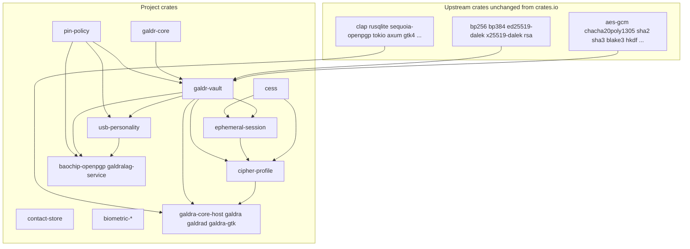

# Crate dependencies and workspace layout

This document explains which **Rust crates come from upstream** (unchanged third-party libraries), which **crates this project created**, and **how they depend on each other**. For per-function navigation, see [CODE_MAP.md](CODE_MAP.md). For the **intended** Xous multi-server layout and **current** single-process `galdralag-service` composition, see [ARCHITECTURE.md](ARCHITECTURE.md#current-implementation-xous).

**Policy:** Cryptographic **primitives** (AES, ChaCha, SHA, ECDH, and similar) are **not** reimplemented in this repository. Firmware and host code call **audited workspace dependencies** from crates.io (mostly RustCrypto). Project crates own **policy, layout, protocols, USB/OpenPGP dispatch, and HAL glue**.

### Three-way classification

| Category | Meaning | Documented in |
|----------|---------|----------------|
| **Unchanged upstream** | crates.io dependency used as published (no project fork of source) | [Upstream crates](#upstream-crates-unchanged-third-party) below |
| **Altered or vendored** | In-tree copy or `[patch.crates-io]` override (same API, pinned for reproducibility) | [Upstream crates](#upstream-crates-unchanged-third-party) — see **`subtle`** exception |
| **Created by this project** | Crates authored and maintained in this repository | [Project crates](#project-crates-created-by-galdralag) below |

Retired in-tree crates (for example the removed `bp512` BrainpoolP512r1 shim) are noted in [CHANGELOG.md](../CHANGELOG.md), not listed as active dependencies.

---

## At a glance

---

## Upstream crates (unchanged third-party)

These are declared in the root [`Cargo.toml`](../Cargo.toml) under `[workspace.dependencies]` and pulled from **crates.io** without project-specific forks. They are used **as libraries**; this firmware does not vendor their source except where noted below.

### Cryptography and constant-time helpers

| Crate | Role in this project |
|-------|----------------------|
| `aes-gcm` | AES-256-GCM AEAD (vault sealing, OpenPGP paths) |
| `chacha20poly1305` | ChaCha20-Poly1305 AEAD |
| `aead` | AEAD trait glue |
| `hkdf`, `pbkdf2`, `hmac` | Key derivation and MAC |
| `sha1`, `sha2`, `sha3`, `blake2`, `blake3` | Digests and KDF inputs |
| `ed25519-dalek`, `x25519-dalek` | Ed25519 / X25519 (OpenPGP AUT/DEC slots) |
| `p256`, `p384` | NIST curves where OpenPGP compatibility requires them |
| `bp256`, `bp384` | Brainpool P-256 / P-384 (primary curve family) |
| `elliptic-curve`, `ecdsa`, `signature`, `ff` | ECDSA and curve arithmetic |
| `rsa` | RSA OpenPGP key support |
| `camellia`, `serpent`, `twofish` | Cascade cipher layers in vault profiles |
| `vsss-rs` | Shamir secret sharing (split/recover) |
| `zeroize` | Secure zeroisation of sensitive buffers |
| `subtle` | Constant-time comparisons (`Choice`, `ConstantTimeEq`) |
| `rand_core`, `rand` | CSPRNG interfaces (host tests and tooling) |

**Exception — `subtle`:** The workspace applies `[patch.crates-io] subtle = { path = "crates/subtle-vendored" }`. That directory is a **vendored copy** of the upstream `subtle` crate (same API; pinned in-tree for reproducible builds). It is **not** project-authored crypto logic.

### Embedded / `no_std` utilities

| Crate | Role |
|-------|------|
| `heapless` | Fixed-capacity collections on device |
| `usb-device` | USB device stack types for personality code |
| `bitflags`, `crc32fast` | Flags and checksums where needed |

### Host-only (std) libraries

Used by `galdra`, `galdrad`, `galdra-gtk`, `galdra-core-host`, and `host-tools`:

| Crate | Role |
|-------|------|
| `clap` | CLI parsing (`galdra`, `xtask`, host-tools) |
| `rusqlite` | Local contacts/groups/audit database |
| `sequoia-openpgp` **2.4.1**, `sequoia-net` **0.30.1** | OpenPGP packet handling and keyserver/WKD fetch (host); pinned in workspace `Cargo.toml` |
| `pcsc` | Smart-card reader access (optional feature) |
| `tokio`, `axum`, `tower`, `tower-http`, `tracing` | `galdrad` REST server |
| `utoipa`, `utoipa-swagger-ui` | OpenAPI for `galdrad` |
| `reqwest`, `ldap3` | HTTP and LDAP key discovery |
| `serde`, `serde_json`, `toml`, `chrono`, `uuid` | Config and persistence |
| `gtk` (gtk4), `libadwaita` | `galdra-gtk` desktop UI |
| `rusb`, `serialport`, `rpassword` | USB and CDC provisioning tools |
| `image`, `rqrr`, `age` | QR and age-related host workflows |
| `cbor4ii` | CBOR for biometric wire types |

Host crates also use the same **cryptographic** workspace deps where they exercise firmware logic on the host (for example `blake3`, `sha2` in `galdra-core-host`).

---

## Project crates (created by Galdralag)

Authoritative membership list: root [`Cargo.toml`](../Cargo.toml) `[workspace] members`. Two firmware-related trees are **`exclude`d** from the main lockfile and built with `--manifest-path` (see [Separate firmware builds](#separate-firmware-builds)).

### Firmware core (`no_std`-oriented)

| Crate | Package name | Purpose |
|-------|--------------|---------|
| `crates/galdr-core` | `galdr-core` | HAL traits (`VaultStorage`, `MonotonicCounter`, `HardwareTrng`, `ZeroiseController`), shared errors, `test-hal` fakes |
| `crates/vault` | `galdr-vault` | RRAM vault layout, sealed keys, Brainpool/RSA helpers, Shamir, cipher implementations **calling** upstream AEAD/hash crates |
| `crates/pin-policy` | `pin-policy` | PIN state machine: counter increment **before** compare; lockout / zeroisation triggers |
| `crates/usb-personality` | `usb-personality` | USB personas and **OpenPGP card application** over CCID (APDU dispatch, DO store, vault backend trait) |
| `crates/ephemeral-session` | `ephemeral-session` | Authenticated ephemeral ECDH sessions and HKDF label wiring |
| `crates/cipher-profile` | `cipher-profile` | Named cipher cascade profiles (registry + policy) |
| `crates/cess` | `cess` | CESS Mode A outer wrapper (HKDF-BLAKE3, ChaCha outer AEAD) |
| `crates/contact-store` | `contact-store` | On-token Galdra contact metadata in RRAM |
| `crates/biometric-api` | `biometric-api` | Biometric match payload, session token, backend trait |
| `crates/biometric-vault` | `biometric-vault` | Template sealing and session HMAC helpers |
| `crates/biometric-fingervein` | `biometric-fingervein` | Finger-vein device driver sketch (host-side) |
| `crates/biometric-sweet` | `biometric-sweet` | Sweet hand-scanner driver sketch (host-side) |
| `crates/security-tests` | `security-tests` | Dudect timing harnesses over selected paths |

### Host applications and libraries (`std`)

| Path | Binary / lib | Purpose |
|------|--------------|---------|
| `galdra-core-host` | library | SQLite schema, contacts/groups, device/OpenPGP helpers, Shamir ops, **Fulla registry client** (`registry.rs`) |
| `galdra` | `galdra` | CLI |
| `galdrad` | `galdrad` | Local REST daemon (biometric pre-gate, policy hooks) |
| `galdra-gtk` | `galdra-gtk` | GTK4 desktop UI |
| `crates/host-tools` | `galdralag-provision`, etc. | CDC PIN provisioning, vector generators, manifest stubs |
| `xtask` | `xtask` | `check-fw`, `build-fw`, `test-all`, fuzz orchestration, `build-and-register` |

### Separate firmware builds

| Path | Crate | Purpose |
|------|-------|---------|
| `crates/baochip-openpgp` | `baochip-openpgp` | Maps OpenPGP vault to **Baochip RRAM** windows on Xous; bridges `usb-personality` to silicon |
| `services/galdralag` | `galdralag-service` | Xous daemon: PDDB PIN bridge, `open_or_provision_backend`, CCID USB loop |

These are excluded from the workspace lockfile because they depend on **xous-core** crates (`pddb`, `bao1x-hal`, …) with a different target triple (`riscv32imac-unknown-xous-elf`). Build via `cargo run -p xtask -- build-and-register` — see [services/galdralag/README.md](../services/galdralag/README.md).

---

## How project crates tie together

### Layer 1 — HAL and policy

- **`galdr-core`** sits at the bottom of **project** code. It defines traits hardware drivers implement and errors other crates share. It depends only on lightweight upstream crates (`zeroize`, `subtle`, `rand_core`).
- **`pin-policy`** depends on **`galdr-core`** for `ZeroisationTrigger` and counter traits. It contains **no** vault or USB knowledge.

### Layer 2 — Vault and crypto orchestration

- **`galdr-vault`** depends on **`galdr-core`**, **`pin-policy`**, and many **upstream** crypto crates (`bp256`, `bp384`, and others). It implements **what** gets sealed in RRAM and **how** keys are derived (`KeyPurpose`, HKDF labels), not new block ciphers.
- **`cess`** implements the CESS outer wrapper using **`blake3`** and **`chacha20poly1305`** from upstream.
- **`ephemeral-session`** ties **`galdr-vault`** + **`cess`** + curve code for forward-secrecy sessions.
- **`cipher-profile`** composes **`ephemeral-session`**, **`galdr-vault`**, and **`cess`** into named profiles the host can select.

### Layer 3 — USB and OpenPGP card

- **`usb-personality`** depends on **`galdr-vault`** and **`pin-policy`**. It implements OpenPGP APDU handling and calls into a **`OpenPgpBackend`** trait; on Xous, **`baochip-openpgp`** supplies the RRAM-backed implementation.
- **`contact-store`** stores Galdra-specific contact records in RRAM, using **`galdr-vault`** and **`pin-policy`** for layout and policy alignment.

### Layer 4 — Xous integration

- **`galdralag-service`** (`services/galdralag`) waits for **`usb-bao1x`** PDDB provisioning, calls **`baochip-openpgp`** to open/provision the vault, then runs **`usb-personality`**'s CCID dispatcher against the Xous USB IPC server. **All three security domains (vault, PIN policy, OpenPGP/CCID dispatch) are statically linked in this one process** — not separate `vaultd` / `pind` / `usbd` servers. The only Xous IPC on the CCID hot path is to **`_Xous USB device driver_`** (`usb-bao1x`).

### Layer 5 — Host stack

- **`galdra-core-host`** reuses **`galdr-vault`**, **`cipher-profile`**, **`ephemeral-session`**, and **`cess`** so host-side encrypt/decrypt and profile tests match firmware semantics. It adds **`sequoia-openpgp`**, **`rusqlite`**, PC/SC, and **`registry`** (Fulla HTTP registry URL resolution and geographic failover for **`galdra keyserver`**).
- **`galdra`**, **`galdrad`**, and **`galdra-gtk`** are thin application shells over **`galdra-core-host`**.
- **`biometric-api`** / **`biometric-vault`** connect **`galdrad`** policy to optional third-factor templates; device drivers (`biometric-fingervein`, `biometric-sweet`) plug in via traits.

### Typical data paths

| Flow | Crate chain |
|------|-------------|
| GnuPG sign on token | Host `gpg` → CCID → **`usb-personality`** → **`galdr-vault`** (sealed SIG key) → upstream ECDSA/Ed25519 |
| Wrong PIN | **`usb-personality`** → **`pin-policy`** (in-process) → **`galdr-core`** zeroise hook → RRAM wipe in **`baochip-openpgp`** |
| Galdra encrypt with profile | **`galdra`** → **`galdra-core-host`** → **`cipher-profile`** → **`ephemeral-session`** + **`cess`** + **`galdr-vault`** |
| First-boot PIN | Host **`galdralag-provision`** → Xous PDDB → **`galdralag-service`** → **`baochip-openpgp`** provision slots |
| Publish key to Fulla registry | **`galdra keyserver push`** → **`galdra-core-host::registry`** → Fulla `POST /api/v1/keys` (optional geographic failover) |

---

## What is intentionally not a workspace crate

| Item | Notes |
|------|--------|
| `psram-store` | Optional decoy/microSD volume — design in [Psram.md](Psram.md); not a workspace member yet |
| `fuzz/` targets | libFuzzer binaries; depend on workspace crates but are not libraries |
| **xous-core** | External checkout (`betrusted-io/xous-core`); provides kernel, `usb-bao1x`, PDDB |

---

## Related documentation

| Document | Contents |
|----------|----------|
| [CODE_MAP.md](CODE_MAP.md) | Per-file function and type index |
| [server.md](server.md) | HTTP registry server design; `galdra keyserver` client and `[keyserver]` config |
| [THREAT_MODEL.md](THREAT_MODEL.md) | Threats, IPC access-control inventory, vendored `usb-bao1x` gaps |
| [dev-ref.md](dev-ref.md) | HAL traits, security invariants, test surface |
| [ARCHITECTURE.md](ARCHITECTURE.md) | Intended Xous servers, current `galdralag-service` topology, RRAM regions, PIN FSM |
| [API_REFERENCE.md](API_REFERENCE.md) | Public API annex (Shamir, ephemeral session, HKDF labels) |
| [README.md](../README.md) | Workspace table and cryptographic dependency policy |
